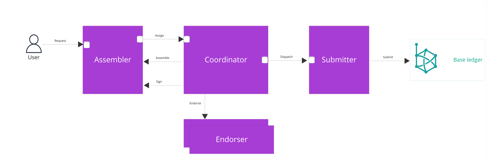

# Distributed transaction managment

There are 4 primary roles that paladin nodes play in the process of ensuring that a users intent for a transaction is finally confirmed on the EVM base ledger.
 - The `Assembler` receives and validates the transaction request from the user and is responsible for assembling the transactions by deciding which states this transaction will spend and what signatures and endorsements are required. Typically, the assembler is also responsible for generating a signature for the transaction using the private key that corresponds to the identity specified in the `From` field for the transaction.
 - The `coordinator` has awareness of which states are available for spending, what actions (e.g. endorsements) are outstanding for each transaction and what dependencies exist between transactions.
 - The `Submitter` is responsible for submitting the transaction to the base ledger.
 - The `Endorsers` are responsible for attesting to the validity of a transaction and providing a signature to that effect that can be verified on the base ledger contract.  There maybe be zero, one or many endorsers for a transaction, usually depending on the domain.

In the simplest of cases, which we will explore in detail below, the `Assembler` `coordinator` and `Submitter` roles can be fulfilled by a single node for each transaction.  However, in some domains, it is beneficial to separate these roles across different nodes so that an optimistic policy can be applied where several transactions from different assemblers are coordinated to speculatively consume the outputs of each other without waiting for each previous transaction to be confirmed on the base ledger and with a high level of confidence that the transactions will be confirmed on the base ledger in an order that will will not invalidate any of the other transactions in the sequence.

To support this distributed runtime architecture, we must consider the data exchange patterns between remote components, persistence, threading model and error handling.

The key data exchange points between the components illustrated in the diagram are:
 - **Request**: The user requests a transaction.  This request is idempotently persisted in the assemblers data store before returning success to the user.
 - **Assign**:  The assembler hands over to a coordinator and this handover is persisted by both parties.
 - **Assemble**: The coordinator calls back to the assembler, presenting a list of available states, and the assembler responds with an assembled transaction.  A single coordinator will serialise all calls to assemble across all transactions that it is coordinating.
 - **Sign**:  The coordinator calls the assembler to sign the transaction.  This is separated from the assemble call so that it can be called in parallel for multiple transactions.
 - **Endorse**: The coordinator calls zero, one or many endorsers per transaction to attest to the validity of the transaction. There is not persistence here.
 - **Dispatch**: The coordinator hands the transaction to a submitted (public transaction manager). At this point the transaction is assigned a signing address and a nonce and beyond this point, the submitter is responsible for submitting that transaction to the base ledger

The internal data exchanges (i.e. not including `Request` and `Submit`) fall into roughly 2 categories
 - persistent syncpoints ( `Assign` `Dispatch`): the handover is persisted by both roles.  If both roles happen to be on the same node, then this handover is coordinated as part of a single database transaction.  If they are on different nodes, then the handover is achieved via the internode transport layer, with acknowledgement messages to assure reliable delivery.
 - non persistent request / reply (`Assemble` `Sign` `Endorse`): There is no persistence on either side of the exchange at this point.  If this communication is between 2 separate nodes, then the coordinator will retry in case of error or timeout. There is no guarantee that successive retries will get the same answer but it is assumed that any of those answers can be used as a valid response.

## coordinator threading model
To understand these data exchanges in detail, it is important to understand the threading model of the coordinator.
First, lets consider the scenario of a single paladin node working in isolation. By nature of the business requirements behind most paladin use cases, this scenario would be extremely unlikely to be of any real value but we consider it here in order to explain some foundational concepts that we will expand upon when we explore more realistic, distributed scenarios.

Persisted state of transactions is updated when:
- transactions are submitted, and assigned a unique transaction id.  The inputs provided by the user are stored and the transaction is assigned to a coordinator.  If the coordinator is on the same node as the assembler, this this persistent update is performed as part of the same database transaction to store the user's request.
- when a transaction is dispatched, a public transaction is prepared for submission to the base ledger.  It is assigned to a signing address and is assigned a nonce.

Between these 2 syncpoints, all state is updated in memory only.  

For each contract, there is a single thread coordinating the preparation of each transaction.  There are some concurrency controls to consider in order to limit the memory and CPU utilisation given that there could be many thousands of contracts active at any one time.  However, for now, lets focus on the case of a single contract.

The single thread thread maintains an in-memory dependency graph between transactions and for each transaction, it maintain an in-memory record of all the information required.

The single threaded event loop is where the bulk of the processing happens.  For each event received on the internal golang channel, the event loop
 - updates the inmemory record for that transaction
 - sends asynchronous requests for any data that is still required to get the transaction ready for dispatch
 - analyses the graph to determine if any of the transactions are ready for dispatch
 - if any transactions are ready for dispatch, then dispatch them to the submitter

A transaction is considered ready for dispatch once the following conditions are true
 - The transaction has been assembled 
 - Any required signatures and endorsements have been gathered 
 - Any transactions that are a dependency of this transaction are either
  - already confirmed on the base ledger
  - are being submitted to the base ledger with the same signing address as this transaction and are also ready to be dispatched or have already been dispatched

Transaction dependencies are either explicitly declared by the user submitting the (dependant) transaction or are derived from the fact that one transaction is assembled to spend the states that are being produced by another transaction.

In order to reach the above conditions, the orchestrator communicates with other components. 

Communication with the assembler is serialised to ensure that coin selection will not result in the same state being spent by more than one transaction.  If the assembler is on the same node as the coordinator, then this is a synchronous, in memory golang function call.

All other actions needed to prepare the transaction for dispatch are completed asynchronously (regardless of whether the request is going to a remote node or not ), including
 
 - resolving the identities of all parties that need to be informed about the transaction. This could be signers, endorsers or receivers of the private data of the transaction outputs.  Resolution of the identity locator to a verifier may require communication with remote nodes.
 - signing a transaction
 - endorsing a transaction

All of the asynchronous communication follows the same pattern

 - the orchestrator send a request message and then the orchestrator thread continues
 - asynchronously, the response message is delivered to the orchestrator.
 - In some cases, the asynchronous request / reply communication is with another paladin node via the transport manager.  Some cases, it is via a asynchronous interface on another internal component ( e.g. identityResovler) and some cases it is via a synchronous interface to an internal component.  In the latter case, to avoid blocking the single orchestrator thread, the synchronous request is offloaded to a "one and done" go routine.
 - Receiving the asynchronous response is an ultra low latency call so as not to block the delivery thread.  The only processing that happens as part of delivery is to write the response message to the orchestrators go channel. The exception to this is the case where, due to the concurrency controls and in case of high latency on the response, it may be the case that the orchestrator (thread and channel) for that contract instance is not currently in memory. In this case, the response is added to a global channel and a single go routine is responsible for reading from that channel and paging in orchestrators as per the concurrently controls.

## coordinator error handling

Given the in-memory and non blocking nature of this request / response message exchange, there is an inherently unreliable quality of service.  There are many error conditions that could occur and potentially prevent the in-memory record for a transaction from reaching a state of "ready to dispatch".  These errors fall into one of 3 categories
 
**Assemble validation errors**.  The domain specific logic has deemed the transaction as invalid. In this case, the transaction is marked as reverted and no further processing is attempted.  This may happen on the first attempt to assemble or may happen after one or more re-assemble attempts.  Either way, all states that may have been locked by this transaction are unlocked.

**Endorsement validation errors**.  If the assembly of a transaction has determined that it is valid, it still may be the case that the endorser has more up to date information (e.g. about the state of other transactions in flight or the state of the base ledger contract) that deems the transaction - as currently assembled - as being invalid.  In case of these errors, the transaction is reassembled.  It may be the case that the attempt to reassemble, given the updated state of the universe will result in assemble validation errors (as described in the previous bullet) or the re-assemble may result in a new version of that transaction that will trigger a fresh attempt at endorsement.

**System errors** AKA unexpected errors:  These may be transient errors ( e.g. network packet loss, remote node downtime...) or more persistent errors ( e.g. code bug, misconfiguration etc..).  The coordinator error handling processing does not attempt to distinguish between transient and persistent errors.  The logic deals with all system errors in the same way.  If any unexpected (i.e. not an assemble validation or an endorsement validation error) occur either 

 - while attempting to send an asynchronous request message 
 - while attempting to process the asynchronous response and update the in-memory record or 
 - if the asynchronous response is not received after a timeout period,

In all of those cases, the orchestrator thread is responsible for detecting that the in-memory record has not been progressed and will attempt to re-send the request message for whatever information is required to progress the in-memory record closer to being ready to dispatch.  Transactions will remain in a perpetual retry loop (as per the configurable retry interval policy) until either a) the transaction is successfully progressed to the "ready to dispatch" state or b) the user cancels the transaction.  See the section on [Observability and control](TODO) for technical detail on how this can be achieved manually or programmatically.
 
NOTE: there is some upfront validation performed when the transaction is submitted.  This validation of the user supplied inputs is performed synchronously and the transaction is not accepted if it fails.  Therefore it is out of scope for the async threading model discussion above.

### Restart recovery
If the node is stopped and and restarted, whether that a controlled restart or a crash, then the in-memory state is rebuilt by replaying the transaction submission events. The orchestrator will then re-send asynchronous requests for any information that is still required to get that transaction ready for dispatch.  As with the error handling protocol, this might mean that the component receiving that request will have already responded to the same request but that duplication of request should be tolerated by the other component and it should send a valid response again. 
 
## Multi node scenarios

Now, lets consider the cases where multiple paladin nodes need to collaborate to support different parties transacting on the same contracts.

## Distribution of private state data
In order of increasing complexity, the first scenario to consider is the case of domains where the only co-ordination required is the sharing of private data off chain.  In this case, the `assembler`, `coordinator` and `submitter` roles are all fulfilled by the same node for any one transaction.  However, in this case there are several of these nodes, processing transactions for different parties concurrently and they need to share data with each other.

This is the key aspect that differentiates paladin contracts from other base ledger evm contracts.  As an example, consider a zero knowledge based privacy preserving token based contract such as zeto. When one party transfers a token to another party ( alice transfers to bob), that is only a useful transfer is bob is then able to spend that token.  In order to spend the token bob needs 2 pieces of information
 1) on chain event to confirm that the transfer of ownership has happened
 2) an off chain message containing the private data for the new state 
NOTE: anyone can see `1` but it would be an opaque blob of masked data without visibility of `2`.

In this scenario. alice's node will assemble a transaction that includes an input state and 2 output states.  One output state will be the transfer of some value to bob and the other output state will be the remaining balance (difference between the value of the input state and the balance transferred to bob) being returned to alice.  The private data for the output state that includes the value transferred to bob is distributed to bob's node so that bob can use that as input to future transactions.

Generally speaking, for every transaction assembled, on any domain, there are multiple output states. For each output state, the domain specific logic specifies a distribution list, which is an array of identity locators.  The node responsible for coordinating the transaction honors this distribution list by sending the private state data to each of those recipients.

It is imperative that bob's node receives the private state data but this distribution is done using the same asynchronous transport messaging described above. So some level of assured deliver protocol is layered on top of that transport.
 1. As part of the same database transaction to dispatch the public transaction, alice's node persists the distribution list for that transaction
 2. After that database transaction has been committed, alices's node sends a transport message containing the private state data to bob's node
 3. bob's node receives the message and writes it to an in-memory go channel ( so as not to block the delivery thread)
 4. bob's node persists the state to its local state manager
 5. bob's node sends an acknowledgement message to alice's node
 6. alices's node receives the acknowledgement and writes it to an in-memory golang channel
 7. alices's node persists the acknowledgment

`4` and `7` are each a single insert to a database table that does not need to be coordinated with any other database updates but is likely batched up with several other, unrelated, updates for the sake of performance.

`4` and `7` are both idempotent (on conflict ignore) so that if either party is in any doubt whether the delivery was complete, they can retry.  Alice's node will periodically attempt step `2` - even after a restart - while step `7` has not happened yet.

Bob's node does not need to be concerned about whether alice received the acknowledgement or not.  In the case where alice's node has not received the acknowledgment, alice's node will resend the state and bob's node will respond with the acknowledgement again although step `4` will be a no-op this time because it has already been persisted.

## Endorsement models

### No endorsement

In the previous scenario, there is no need for transactions to be endorsed by another party before being submitted to the base ledger contract.  This is typical for zero knowledge based attestation because the base ledger contract can verify the validity of the proof without leaking any of the private data.

However, with other attestation approaches, the base ledger contract can only verify that a set of signatures are valid for the provided masked data and that they were signed by the bearers of specific private keys.  The collection of these signatures before submitting to the base ledger is what we describe as endorsement

### Notary endorsement 

In the notary endorsement model, the assembler choses a single verifier to endorse all transactions and the base ledger contract is configured to verify that all transactions submitted have indeed been signed by that single notary.

### 100% endorsement

In the 100% endorsement model, each private contract has a predetermined privacy group that never changes for the life of that contract.  Every transaction must be endorsed by every identity in that privacy group.

### Other endorsement models
There may be other endorsement models to consider in future but currently, all known domains require either `no endorsement` (zeto) `single notary endorsement` (noto) or `100% endorsement` (pente).

### Communication with remote endorsers

In the single node scenario described earlier in this topic, we discussed the asynchronous request / reply interface to the orchestrator.  Communication with one or more remote nodes for endorsement gathering is achieved using this request / reply mechanism and reliable delivery is achieved via the "requester retries" model. There is no need to co-ordinate persistent state across requester and endorser and the endorser can remain stateless.  

## Distributed co-ordination and submission

### coordinator selection

The assembler node selects which node will be responsible for coordinating each transaction. 

The choice of coordinator impacts the potential states that are available as input states for the transaction and therefore the parallelization of the contract. 

In most domains, transactions assembled on one node typically consume states that are produced by transactions that have been assembled on other nodes. When multiple transactions are being coordinated on separate nodes, then the dependant transaction can only be assembled after the dependency transactions have been confirmed on chain.  This is because the assembly function can only assemble a transaction using the `available states` that are presented to it by the coordinator. The set of states that the coordinator presents to the assembly function is restricted to the set of states that have been confirmed on base ledger but not yet spent and the set of states that have been produced by other transactions being coordinated by this coordinator.  

Therefore, to achieve a throughput of higher than one transaction per block, such sequences of transactions must be coordinated by the same node.  They must be assembled by whichever node holds the keys to sign the private transaction so the assembling node and the coordinating node can be different nodes and a reliable remote handover protocol exists between the assembling node and the coordinating node.

Another advantage of this model is that it minimizes contention for states.  When the coordinator present the list of available states to the assembly function, it does not include states that are `locked`.  I.e. states that have already been selected by other in-flight transactions being coordinated by that same node.

The trade off here is that all transactions coordinated by the same node, are assembled in series.  The invocation of the assemble function is single threaded per coordinator across all assemblers.

If the selected `coordinator` happens to be on the same node as the `assembler`, then the handover between them is a locally coordinated database transaction.

If they selected `coordinator` is on a different node from the `assembler`, then the handover between them is a reliable delegation handshake similar to the distribution of private state data described above.

### Submitter selection

In all cases discussed so far, the endorser(s) is just a remote component that the coordinating node communicates with via the async request / reply pattern described above and that communication is done once all endorsements have been collected.   However, in some cases, the domain specific logic may specify that a particular endorser must submit the transaction.  This may be for reasons of anonymity and/or efficiency. In future, there may be other factors or domain specific policy that influence the submitter selection. 

In this case, the handover between the coordinator and the submitter is not as simple as the local coordinated database transaction as described earlier.  A reliable delegation handshake is required similar to the distribution of private state data described above.  If it so happens that the coordinator role is being provided by the same node as the submitter, then the local co-ordinate database transaction described earlier is good enough.  This happens to be true for 100% of the cases that are currently known.  So implementation of the remote hand off between coordinator and submitter is deferred for now.

### Deferred submission 

There are cases where it is desirable to co-ordinate a transaction to the point where it is ready to be submitted to base ledger but not handover to a submitter just yet. TODO - add details of why and how.

### Default behaviour

The default policy for coordinator and submitter selection is as follows
 - Initially transactions are coordinated by the same node as the `assembler` 
 - Once a transaction has been assembled, the resulting attestation plan will influence the coordinator selection
   - if the attestation plan does not include any endorsers, then the `assembler` node will be selected as `coordinator`
   - if the attestation plan includes endorsers then a node hosting one of those endorsers must be selected as `coordinator`
   - if one of the endorsers is marked as `EndorserMustSubmit` then the node hosting that endorser identity is selected to be the coordinator
   - otherwise, if one of the endorsers is hosted on the same node as the `assembler` then that node is selected as `coordinator`
 - If the `coordinator` detects contention between 2 or more transactions for the same input state then it will delegate to another `coordinator` . The choice of coordinator is a deterministic and fair function that can be replicated, with the same result, on all `coordinator`s of all inflight transactions.  It is a function of the total set of transactions in flight which all `coordinators` should eventually converge on the same awareness of 
   - TODO need to figure out how we ensure that the choice settles on a single `coordinator` given that new transactions could be continually arriving.  Do we put a max size (per assembler node) on the number of inflight transactions going into this contention resolution / `coordinator` election algorithm?
   - TODO link to a more detailed doc for the contention detection and resolution algorithm
 - Once a `coordinator` has deemed that a transaction is ready for dispatch to a `submitter` then it dispatches it to a signing address on its local node unless there are any specific constraints on the transaction that would prevent that
  - currently there are no known cases where this would not be possible so there is no `else` implemented at this moment in time.

This default behaviour functionally sufficient for the 3 initial domains of `zeto` , `noto` and `pente` so there is currently no mechanism to override this default behaviour.  However, in future, it may be possible to customise this policy to better optimise for these domains or to provide functional correctness for future domains that are not able to work with this default behaviour.

The following sections articulate how this default logic manifests in correct behaviour for the 3 built in domains:

#### Zeto

Zeto transactions do not require endorsements.  So the default behaviour results in each transaction being `assembled` `coordinated` and `submitted` on the same node.  There may be multiple nodes assembling, coordinating and submitted transactions concurrently but the only interaction between the nodes is the sharing of private data for new states minted.

There is no risk of state contention because each state has exactly one owner and only the owner can spend that state.  So it would be impossible for 2 nodes to assemble a valid transaction to spend the same state.

#### Noto

Noto transactions are always assembled with an attestation plan of a single endorser and a directive that endorser must submit.  The endorse is always the same identity for every transaction for a given noto contract. Otherwise known as the notary.  So all nodes would delegate `coordinator` role to the notary node and it would hand over to `submitter` on its local node.

As with Zeto, there is no risk of state contention because each state has exactly one owner and only the owner can spend that state.

The downside here is that the assembly of all contracts is single threaded on the single coordinator so there may be a potential optimisation to explore in future that exploits the fact that this domain has no risk of state contention. e.g. each node could co-ordinate its own transactions.  However, that would come with another parrelisation trade-off because transactions coordinated by one node cannot speculative spend the output states of transactions   

#### Pente

The emergent bevahiour in a pente domain instance depends on the level of concurrency.  Within a single instance of the domain ( Pente contract) there may be multiple private evm contracts.  A low level of concurrency is defined as the case where there is never more than one transaction in flight (has been assembled but not yet been confirmed on base ledger) for the same pente contract. In the case of low level of concurrency, every node defaults to coordinating and submitting transactions on the same node that they were assembled.  There is never any contention detected and therefore never any need to delegate to other coordinators or submitters.

High level of concurrency is defined as more than one transaction in flight for the same pente contract and therefore there is likely to be a contention for state. In the case of high level of concurrency, given that pente is a 100% endorsement model, all coordinators will detect that other nodes are coordinating transactions and will converge on an agreed single coordinator for the current in-flight transactions.

In future, it may be possible to optimse the behaviour so that multiple nodes can independently co-ordinate concurrent sequences of transactions for the same pente contract so long as transactions being coordinated by one node do not attempt to call or read private evm contracts that are called by transactions being coordinated by another node.  However, that adds complexity esp. when you consider the fact that the contract(s) a transaction will call / read could change when that transaction is re-assembled.  So for now, we assume that any 2 concurrent transactions in flight for the same pente contract are likely to cause state contention and will need to be coordinated by the same node.

