# Distributed Sequencer Protocol

In domains (such as Pente) where the spending rules for states allow any one of a group of parties to spend the state, then we need to coordinate the assembly of transactions across multiple nodes so that we can maximize the throughput by speculative spending new states and avoid transactions being reverted due to double concurrent spending / state contention.

To achieve this, it is important that we have an algorithm that allows all nodes to agree on which of them should be selected as the coordinator at any given point in time. And all other nodes delegate their transactions to the coordinator.

## Objectives 

The objective of this algorithm is to maximize efficiency ( reduce probably for revert leading to retry cycles of valid request) and throughput ( allow many transactions to be included in each block).  This algorithm does not attempt to provide a guarantee on final data consistency but instead relies on the base ledger contract to do so (e.g. double spend protection, attestation validation, exactly once intent fulfillment).

 The desired properties of that algorithm are

 - **deterministic**: all nodes can run the algorithm and eventually agree on a single coordinator at any given point in time. This is a significant property because it means we don't want to rely on a message-based leader election process like in some algorithms such as Raft. This reduces the overhead of message exchanges among the nodes
 - **fair**: the algorithm results in each node being selected as coordinator for a proportional number of times over a long enough time frame
 - **fault tolerant**:  Although pente already depends on all nodes being available (because of the 100% endorsement model) the desired algorithm should be future proof and be compatible with <100% endorsement model where network faults and down time of a minority of nodes can bee tolerated.

## Summary
The basic premises of the algorithm are:

 - The sender node for each transaction is responsible for ensuring that the transaction always has one coordinator actively coordinating it by detecting and responding to situations where the current coordinator becomes unavailable, a more preferred coordinator comes back online or preference changes due to new block height.  
- Ranking of the preference for coordinator selection for any given contract address, for any given point in time ( block height) is a deterministic function that all nodes will agree on given the same awareness of make up of committee 
 - Composition of committee i.e. the set of nodes who are candidates for coordinator is universally agreed (similar to BFT algorithms).
 - Liveness of the coordinator node can be detected via heartbeat messages (similar to RAFT) but absence of heartbeat messages is not an indicator of unavailability. The handshake to send / resend delegation requests is the only protocol point that can be relied on to detect unavailability of the coordinator.  This process is triggered by absence of heartbeat messages.
 - Choice of coordinator can change over time either due increase in block height triggering a rotation of the responsibility or the current coordinator being detected as unavailable. 
 - Situations can arise where different nodes chose different coordinators because of different awareness of block height and/or different awareness of availability.  The algorithm is less efficient when this happens but continues to function and can return to full efficiency as soon as the situation is resolved.
 - There is no need for election `term`s in this algorithm.
 - When coordinator responsibility is switched to another node, each inflight transaction is either re-assigned to the new coordinator or flushed through to confirmation on the base ledger
 - If the sender deems the transaction to be no longer valid, it is responsible for finalizing it as reverted.
 - If the sender deems the transaction not ready to be submitted, it is responsible for parking it until it is ready.
 - If the sender deems a failed transaction is worthy of retry, it is responsible for retrying at a frequency that does not cause excessive load on the system.
 - The sender node continues to monitor and control the delegation of its transaction until it has received receipt of the transactions' confirmations on the base ledger. This provides an "at least once" quality of service for every transaction at the distributed sequencer layer. As described earlier the blockchain enforces "at most once" semantics, so there is no possibility of duplicate transactions.
 - The handshake between the sender node and the coordinator node(s) attempts to minimize the likelihood of the same transaction intent resulting in 2 valid base ledger transactions but cannot eliminate that possibility completely so there is protection against duplicate intent fulfillment in the base ledger contract

## Transaction lifecycle

#### Senders transaction state

The states that a transaction goes through, from the perspective of the transaction sender are:

  - Queued: The transaction has been accepted by the sender (e.g. via a call to its `ptx_sendTransaction` or `ptx_prepareTransaction` RPC API) but hasn't yet been delegated to a coordinator.
  - Delegated: The transaction has been delegated to a coordinator but hasn't yet been prepared for dispatch
  - Prepared: A base ledger transaction has been prepared for this transaction and the sender has granted permission for the coordinator to dispatch that prepared transaction to a submitter. It is unknown, to the sender, whether the submitter has received the dispatch yet or not.
  - Dispatched: The prepared base ledger transaction has been dispatched to a submitter
  - Reverted: The transaction has been finalized as reverted.  There will be no further attempt to process this transaction. This is a final state.
  - Confirmed: The base ledger transaction has been confirmed.  This is a final state.

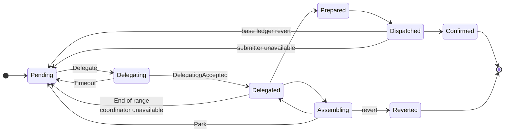
```mermaid
stateDiagram-v2
    direction LR
    [*] --> Pending
    Pending --> Delegating: Delegate
    Delegating --> Delegated: DelegationAccepted
    Delegating --> Pending: Timeout
    Delegated --> Assembling
    Assembling --> Delegated
    Assembling --> Pending : Park
    Delegated --> Pending: End of range <br/> coordinator unavailable
    Dispatched --> Confirmed
    Delegated --> Prepared
    Prepared --> Dispatched
    Dispatched --> Pending : base ledger revert
    Dispatched --> Pending : submitter unavailable
    Assembling --> Reverted : revert
    Confirmed --> [*]
    Reverted --> [*]

```

#### Coordinators transaction state

The states that a transaction goes through, from the perspective of the transaction coordinator are:

  - Queued: The transaction has been accepted by the coordinator and is in a single threaded queue waiting to be assembled
  - Assembling: The transaction has been sent to the sender along with a domain context that may be used to assemble the transaction
  - Attestation: The transaction has been assembled and signed and is awaiting sufficient endorsements to fulfil the attestation plan
  - Confirmation: The transaction has been endorsed, a base ledger transaction has been prepared and the coordinator is waiting for confirmation from the sender that the transaction may be dispatched
  - Dispatched: The transaction has been dispatched to a submitter
  
Note: Strictly speaking, this is the lifecycle of a single `delegation`, The same transaction may go through several delegation flows before finally being 

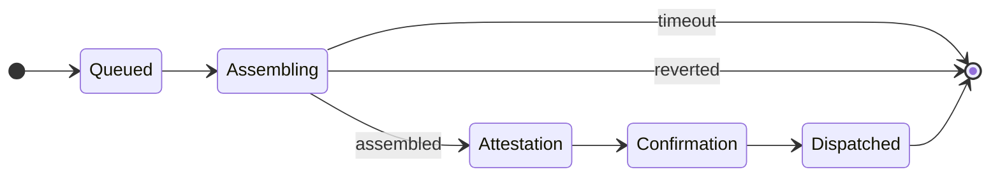
```mermaid
stateDiagram-v2
    direction LR
    [*] --> Queued
    Queued --> Assembling
    Assembling --> [*] : timeout
    Assembling --> [*] : reverted
    Assembling --> Attestation : assembled
    Attestation --> Confirmation
    Confirmation --> Dispatched
    Dispatched --> [*]
```

## Detailed Walkthrough

To describe the algorithm in detail, we break it down to sub problems.

### Composition of committee

A smart contract instance of a domain opts into use of the distributed sequencer algorithm, and initializes it with the composition of the committee during the `InitContract` stage. This occurs individual on each node in the committee based on the on-chain configuration information that is written to the base ledger.
The Pente privacy group smart contract, is an example of domain that uses the dynamic sequencer algorithm. The list of node-qualified signing identities that are candidates for coordinator selection is declared to be a set of anonymous addresses with a unique address allocated for member of the privacy group (future versions might choose to this to be a subset of the privacy group).

### Coordinator selection

This is a form of leader election but is achieved through deterministic calculation for a given point in time ( block height), given predefined members of the group, and a common (majority) awareness of the current availability of each member. So there is no actual "election" term needed.

Each committee member is allocated positions on a hash ring.  These positions are a function of the node-qualified signing identity.  Given that the entire committee agrees on the names of all nodes and the unique identity of each committee member, all nodes independently arrive at the same decision about the positions of all committee members.

For the current block height, a position on the ring is calculated from a deterministic function.  The committee member that is closest to that position on the ring is selected as the coordinator.  If the node for that identity is not available, then the next closest member is selected. If that node is not available, then the next closest again is selected, and so on.

For each smart contract instance in the domain, the coordinator is selected by choosing one of the nodes in the configured privacy group of that contract

 - the selector is a pure function where the inputs are the node names + the current block number and the output is the name of one of the nodes
 - the function will return the same output for a range of `n` consecutive blocks ( where `n` is a configuration parameter of the policy)
 - for the next range of `n` blocks, the function will return a different ( or possibly the same) output
 - over a large sample of ranges, the function will have an even distribution of outputs
 - the function will be implemented by taking a hash of each node name, taking the hash of the output of `b/n` (where b is the block number and `n` is the range size) rounded down to the nearest integer and feeding those into a hashring function.

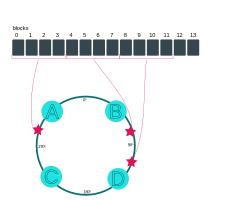{ width="500" }

In the example here, lets say we chose a hash function with a numeric output between 0 and 360 where the hash of node A's name happens to be 315, node B is 45, node C is 225 and node D is 135.  Lets say we have a range size of 4, therefore for block numbers 1-4, we can calculate that they belong to range number 1, blocks 5-8 belong to range number 2 and so on.  Lets say that the hash function, when applied to `range1` returns 310.  When applied to `range2` returns 55 and when applied to `range3` returns 120.  Interpreting all of those hash output as degrees and plotting them on the circle ( with 0° at the top). We can then deterministically calculate that nodeA is selected while the block height is between 1 and 4, node B is selected when the block height is between 5 and 8 and node D is selected while the block height is between 9 and 12

NOTE: this is a contrived, simplified example for illustration.  In reality, the hashes are not uniformly distributed around the ring so to achieve an even distribution, virtual nodes are used.  Each node is assigned multiple locations on the ring by running the hash function on multiple deterministic mutations of the node name.  

<!-- TODO should "Node availability detection" and "Network partition" sections move down and come after "Coordinator switchover" and "Variation in block height"-->
### <a name="node-availability-detection">Node availability detection

When a node starts acting as the coordinator it will accept delegation requests from any other node in the group.  It  periodically sends a heartbeat message to all nodes in the privacy group. The heartbeat message sent to each `sender` node contains the list of transaction ids that the coordinator is actively coordinating and were delegated by that `sender` node. 

All sender nodes keep track of the current selected coordinator for all inflight transactions.  If they fail to receive a heartbeat message from the current coordinator, or if they receive a heartbeat message but it does not contain all of the transaction ids that they expect, then they will re-trigger the [coordinator selection process](#subprocess-select-coordinator).

The delegation process has a handshake that defines the conditions to presume that the coordinator is unavailable. If this handshake leads the sender to determine that the chosen coordinator is unavailable, then it will chose the next closest committee member in the hashring (e.g. by reevaluating the hashring function with the unavailable members removed).

For illustration, consider the following example where nodes B, C, and D have recognized node A as the coordinator and have delegated transactions (labelled `B-1`, `C-1` and `D-1` )to it.

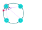{ width="500" }

Node A then proceeds to broadcast heartbeat messages

{ width="500" }


Suddenly, Node A stops sending heartbeat messages, either because:

 - It has crashed and failed to recover
 - It has been stopped by its operator and has not been restarted
 - It has lost network connectivity to other nodes
 - It has crashed, or has had a controlled restart, is now running again but has lost all in-memory context about any active transactions in this privacy group.

For this scenario, we illustrate what happens in the case of one of the first 3 bullets.  See [coordinator failover](senders-responsibility-coordinator-failover) section for more details on the 4th case.

{ width="500" }

When nodes B and D realize that the heartbeats have stopped, then they each retry the [coordinator selection process](#subprocess-select-coordinator).  Again, they chose `A` as the preferred coordinator and send a `DelegationRequest`to node A

{ width="500" }

A timeout in the delegation handshake tells nodes B, C and D that node A is unavailable.  Node B and D each independently select node C as the next closest node on the ring and delegate their inflight transactions to it.  Similarly, nodeC selects itself as the coordinator and continues to coordinate its own transaction `C-1` along with the delegated transactions from node B and node D.

{ width="500" }

Node C then proceeds to act as coordinator and sends periodic heartbeat messages to the other nodes. 

{ width="500" }

If Node A comes back online, what happens next depends on whether: 

 - Node A was truly offline i.e. its process crashed or gracefully shutdown and has now restarted. In this case, Node A will send `startup` messages to all other nodes as soon as it detects activity on this privacy group. See <a href="#startup">Start up processing</a> for details on the logic for detecting activity and sending / receiving `startup` messages.
 - Node A continued to run, but was isolated from the other nodes due to a network outage.  In this case, Node A will resume sending heartbeat messages for any transaction that it was coordinating. In the special case where NodeA does not have any transactions in flight, then the startup message processing will be triggered, similarly to the previous bullet. 
 

{ width="500" }

As soon as nodes B. C and D receive the startup messages from node A they each independently concur that node A is the preferred choice for coordinator and delegate any inflight transactions to it.  Node C decides to cease acting as coordinator and abandons any transactions that it has in flight.

{ width="500" }


This universal conclusion is reached without any communication necessary between nodes B, C and D and without any knowledge of recent history.  Therefore is tolerant to any failover of nodes B, C or D in the interim and has a deterministic conclusion, that can be predicted by node A regardless of what other activity happened to occur while node A was offline (e.g. if node C had gone offline and coordinator role switched to B, or switch back to C ) 


### Network partition
The sender node ultimately bears the responsibility of selecting a coordinator for their transactions. If a single coordinator is universally chosen, the algorithm operates accordingly with maximum efficiency and data integrity (transactions are successfully confirmed on base ledger and no state is double spent). 

If multiple nodes select different coordinators, the system’s efficiency suffers significantly but the eventual "correctness" of the on chain state is not adversely affected. The algorithm is designed to minimize the likelihood of this occurrence. However, the probability of this eventuality is never zero. For instance, in the case of network partitions, this exact situation can emerge.  In this case the base ledger contract provides protection against double spending and all transactions may even eventually be processed (depending on how the endorsement policy is affected) albeit at a much reduced efficiency given the likely hood for failure and retry.

Given the behavior of the current version of Pente domain, when there is a network partition situation then neither coordinator will be able to achieve endorsement due to the 100% endorsement policy.  However, as a more general design and analysis, we consider the hypothetical future case of <100% endorsement.  For certain endorsement policies, each coordinator could theoretically get to the point of submitting transactions to the base ledger.   Each coordinator is operating with a different domain context ( a different awareness of which states have been spent / are earmarked to be spent)  therefore transactions from different coordinators would attempt to spend the same state.  Depending on the relative order that those transactions are added to a block, then transactions from one side or the other of the partition will be reverted and will need to be reassembled.

Whether the coordinators were able to limp along or had came to a halt, or some combination, in either case, once the network connectivity has been restored, the system returns to an efficient operational state.

In the following illustration, a network partition occurs which resulting in nodes A and B continuing to communicate with each other but not with nodes C or D meanwhile nodes C and D can continue to communicate with each other.

{ width="500" }


Once the network connectivity has been restored, the heartbeat messages from both coordinators are received by all other nodes.

{ width="500" }

At this point, node B and node C independently conclude that node A is the preferred coordinator and accordingly, they delegate their transactions to node A.  Node C ceases to act as coordinator and abandons any transactions that it has in flight.

{ width="500" }

The system reaches the desired eventual state of node A being coordinator, sending heartbeat messages to all nodes

{ width="500" }

<!--
TODO

 - might be useful to illustrate the "limp mode" in more detail where both coordinators are managing to get transactions through but the base ledger contract is providing double spend protection and the retry strategy of the coordinator means that transactions are eventually processed correctly 
 - all of the above seems to assume that the network partition affects communication between paladin nodes but not the blockchain.  Should really discuss and elaborate what happens when the block chain nodes are not able to communicate with each other ( esp. in case of public chains where long finality times are possible).  The TL;DR is - notwithstanding this algorithm, the paladin core engine and its management of domain contexts must be mindful of the difference between block receipts and finality and should have mechanisms to configure the number of confirmed blocks it considers as final and/or to reset domain contexts and redo transaction intents that ended up on blocks that got reversed.
 -->
 
### Coordinator switchover
When the block height reaches a range boundary then all nodes independently reach a universal conclusion to chose the new coordinator.

Lets consider the case where the scenario explored above continues to the point where the blockchain moves to start mining block 5.  In the interim, while node A was coordinator, nodes B, C and D delegated transactions `B-1`, `B-2`, `B-3`,  `C-1`, `C-2`, `C-3`, `D-1`, `D-2` and `D-3`,  and A itself has assembled `A-1`, `A-2`, `A-3`.

`A-1` , `B-1`, `C-1` and `D-1` have already been submitted to base ledger and confirmed.  
`A-2` , `B-2`, `C-2` and `D-2` have been prepared for submission, assigned a signing address and a nonce but have not yet been mined into a confirmed block.  NOTE it is irrelevant whether these transactions have been the subject of an `eth_sendTransaction` yet or not.  i.e. whether they only exist in the memory of the paladin node's transaction manager or whether they exist in the mempool of node A's blockchain node.  What is important is that

 - they have been persisted to node A's database as being "dispatched" and
 - are not included in block 4 or earlier

Note: the suffixes `1` `2` and `3` do not imply any explicit ordering relationship between the transactions here and is simply to illustrate rough timing of when the transactions were initiated.  In this example, they happen to retain that order but there is no guarantee provided by the protocol that will be the case.  If there are requirements for explicit dependencies between transactions, then the`sender` must not delegate the dependant transactions until it has received confirmation from the base ledger that the dependencies have been completed.

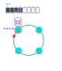{ width="500" }

As all nodes in the group ( including node A) learn that the new block height is 4, they will recognize node B as the new coordinator

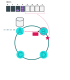{ width="500" }

Node A will continue to process and monitor receipts for transactions `A-2` , `B-2`, `C-2` and `D-2` but will abandon transactions `A-3` , `B-3`, `C-3` and `D-3`.  Abandoned transactions will not be included in any future heartbeat messages.

<!--  TODO edit image to illustrate submitter heartbeat messages { width="500" } -->

Node A, as submitter (note in future it may be the case that the submitter is a different node to the coordinator) for transactions `A-2` , `B-2`, `C-2` and `D-2` will continue to send `SubmitterHeartbeatNotification` messages until those transactions have been confirmed on the base ledger. All sender nodes will hold off from delegating `A-3` , `B-3`, `C-3` and `D-3` - or any new transactions to node B while these `SubmitterHeartbeatNotification` messages are being received.

Once all in flight dispatched transactions have been confirmed, node A stops sending the heartbeat messages and transactions  `A-3` , `B-3`, `C-3` and `D-3` are delegated to node B by their respective senders.  

 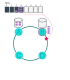{ width="500" }


Eventually transactions `A-3` , `B-3`, `C-3` and `D-3` are confirmed on the base ledger.

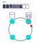{ width="500" }

Note that there is a brief dip in throughput while node A flushes through the pending dispatched transactions and there is also some additional processing for the inflight transactions that haven't been dispatched yet.  So a range size of 4 is unreasonable and it would be more likely for range sizes to be much larger so that these dips in throughput become negligible.


### Variation in block height
It is likely that different nodes will become aware of new block heights at different times so the algorithm must accommodate that inconsistency. 

 - Given that different nodes index the blockchain events with varying latency, it is not assumed that all nodes have the same awareness of "current block number" at any one time. This is accommodated by the following
 - Each node delegates the transactions submitted locally to it by applications, to which ever node it determines as the current coordinator based on its latest knowledge of "current block"
 - The delegate node will accept the delegation if its awareness of current block also results in it being chosen by the selector function.  Otherwise, the delegate node rejects the delegation and includes its view of current block number in the response
 - On receiving the delegation rejection, the sender node can determine if it is ahead or behind (in terms of block indexing) the node it had chosen as delegate.  
 - If the sender node is ahead, it continues to retry the delegation until the delegate node finally catches up and accepts the delegation
 - If the sender node is behind, it waits until its block indexer catches up and then selects the coordinator for the new range
 - Coordinator node will continue to coordinate ( send endorsement requests and submit endorsed transactions to base ledger) until its block indexer has reached a block number that causes the coordinator selector to select a different node.
 - At that time, it abandons all inflight transactions that have not yet been dispatched, stops sending heartbeat messages and will reject any further delegation requests.
 - The sender for each of those abandoned transactions will stop receiving heartbeat messages and will either attempt to delegate to the old coordinator again or to the new coordinator depending on the current block height of that sender as above.
 - While a node is the current selected coordinator, it sends endorsement requests to every other node for every transaction that it is coordinating
 - The endorsement request includes the name of the coordinator node
 - Each endorsing node runs the selector function to determine if it believes that is the correct coordinator for the current block number
 - If not, then it rejects the endorsement and includes its view of the current block number in the rejection message
 - When the coordinator receives the rejection message, it can determine if it is ahead or behind the requested endorser
 - If the coordinator is ahead, it retries the endorsement request until the endorser catches up and eventually endorses the transaction
 - If the coordinator is behind, then it waits until its block indexer reaches the next range boundary and delegates all inflight transactions to the new coordinator


### Sender's responsibility

The sender node for any given transaction remains ultimately responsible for ensuring that transaction is successfully confirmed on chain or finalized as failed if it is not possible to complete the processing for any reason.  While the coordination of assembly and endorsement is delegated to another node, the sender continues to monitor the progress and is responsible for initiating retries or re-delegation to other coordinator nodes as appropriate.

Feedback available to the sender node that can be monitored to track the progress or otherwise of the transaction submission:

 - when the sender node is choosing the coordinator, it may have recently received a [coordinator heartbeat messages](#message-coordinator-heartbeat-notification) from the preferred coordinator or an alternative coordinator
 - when sending the delegation request to the coordinator, the sender node expects to receive a [delegation accepted message](message-transaction-delegation-accepted).  This is not a guarantee that the transaction will be completed.  At this point, the coordinator has only an in-memory record of that delegated transaction
 - [coordinator heartbeat messages](#message-coordinator-heartbeat-notification).  The payload of these messages contains a list of transaction IDs that the coordinator is actively coordinating
 - [dispatch confirmation request](#message-exchange-dispatch-confirmation).  Once the coordinator has fulfilled the attestation plan, it sends a message to the transaction sender requesting permission to dispatch. If, for any reason, the sender has already re-delegated to another coordinator, then it will reject this request otherwise, it will accept.
 - blockchain event.  The base ledger contract for each domain emits a custom event that included the transaction ID.  The sender node will detect when such an event corresponds to one of its transactions and will record that transaction as confirmed.
 - transaction reverted message.  When the submitter fails to submit the transaction, for any reason, and gives up trying , then a `TransactionReverted` message is sent to the sender of that transaction.  There are some cases where the submitter retries certain failures and does *not* send this message.

Decisions and actions that need to be taken by the sender node

 - When a user sends a transaction intent (`ptx_sendTransaction` or `ptx_prepareTransaction`), the sender node needs to chose which coordinator to delegate to.
 - If the block height changes and there is a new preferred coordinator as per the selection algorithm then the sender node needs to decide whether to delegate the transaction to it. This will be dependent on whether the transaction has been dispatched or not.
 - If the heartbeat messages sent by the coordinator node do not include all of the transactions that the sender has delegated to that coordinator, or if the if the sender stops receiving heartbeat messages from the preferred coordinator then then the sender node needs to decide to re-delegate those transactions to the preferred coordinator
 - If the sender does not receive a delegation accepted message from the coordinator in a timely manner, then it considers the coordinator as unavailable and choses an alternative coordinator
 - If a transaction has been delegated to an alternative coordinator and the preferred coordinator becomes available again, then the sender needs to decide to re-delegate to the preferred coordinator.  See [Node availability detection](#node-availability-detection) for details on how the sender can detect when the coordinator becomes available again.
 - Given that there could have been a number of attempts to delegate and re-delegate the transaction to different coordinators, when any coordinator reaches the point of dispatching the transaction, the sender needs to decide whether or not it is valid to dispatch at the time, by that coordinator
 - If the base ledger transaction is reverted for any reason, then the sender decides to retry

To illustrate, lets consider the following scenarios.  We start with simple happy path and then explore more realistic, but still happy paths, where the coordinator switchover happens naturally when the block height reaches then end of a predefined range.  Given that different nodes are likely to become aware of block height changes at different times, there are 6 different permutations of the order in which the 3 nodes ( sender, previous coordinator, new coordinator) become aware of the new block height but to understand the algorithm, we can reduce the analysis to 3 more general cases.  We then explore some error scenarios like failover where in-memory storage is lost on one or more nodes and availability issues where the nodes stop running or are unreachable.  There is no persistence checkpoints between the transaction intent being received by the sender node and the transaction being dispatched to the base ledger submitter so in the failover cases, if either the sender or coordinator node process restarts, then it loses all context of that delegation.

 - [Simple happy path](#senders-responsibiliy-simple-happy-path)
 - [Happy path with switchover](senders-responsibility-coordinator-switchover)
     - [When the new coordinator is behind](#senders-responsibility-coordinator-switchover-new-coordinator-behind)
     - [When the previous coordinator is behind](#senders-responsibility-coordinator-switchover-original-coordinator-behind)
     - [When the sender is behind](senders-responsibility-coordinator-switchover-original-sender-behind)
 - [Failover cases](#senders-responsibility-failover) 
     - [Sender failover](#senders-responsibility-sender-failover)
     - [Coordinator failover](#senders-responsibility-coordinator-failover)
 - [Coordinator becomes unavailable](#senders-responsibility-coordinator-becomes-unavailable)
 - [Submitter becomes unavailable](#senders-responsibility-submitter-becomes-unavailable)

#### <a name="senders-responsibility-simple-happy-path"></a>Simple happy path

Sender delegates transaction to a coordinator and that coordinator eventually successfully submits it to the base ledger contract.

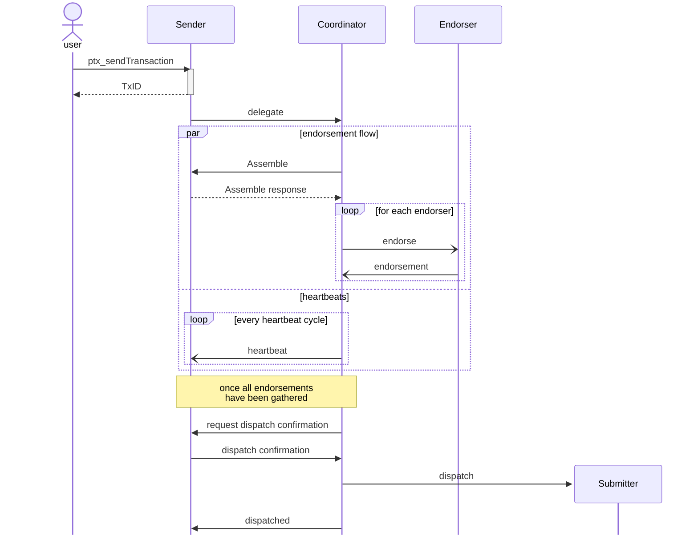
```mermaid
sequenceDiagram
  %%{init: { "sequence": { "mirrorActors":false }}}%%
  actor user
  participant S as Sender
  participant C as Coordinator
  participant E as Endorser
  user->>S: ptx_sendTransaction
  activate S
  S -->> user: TxID
  deactivate S
  S->>C: delegate
  par endorsement flow
    C->>S: Assemble
    S-->>C: Assemble response
    loop for each endorser
      C -) E: endorse
      E -) C: endorsement
    end
  and heartbeats
    loop every heartbeat cycle
      C -) S: heartbeat
    end
  end
  Note over S, C: once all endorsements <br/>have been gathered
  C->>S: request dispatch confirmation
  S->>C: dispatch confirmation
  create participant SB as Submitter
  C->>SB: dispatch
  C->>S: dispatched
```

#### <a name="senders-responsibility-coordinator-switchover"></a>Coordinator switchover

Sender delegates transaction to a coordinator but before the transaction is ready for submission, the block height changes, a new coordinator is selected which then  eventually successfully submits it to the base ledger contract

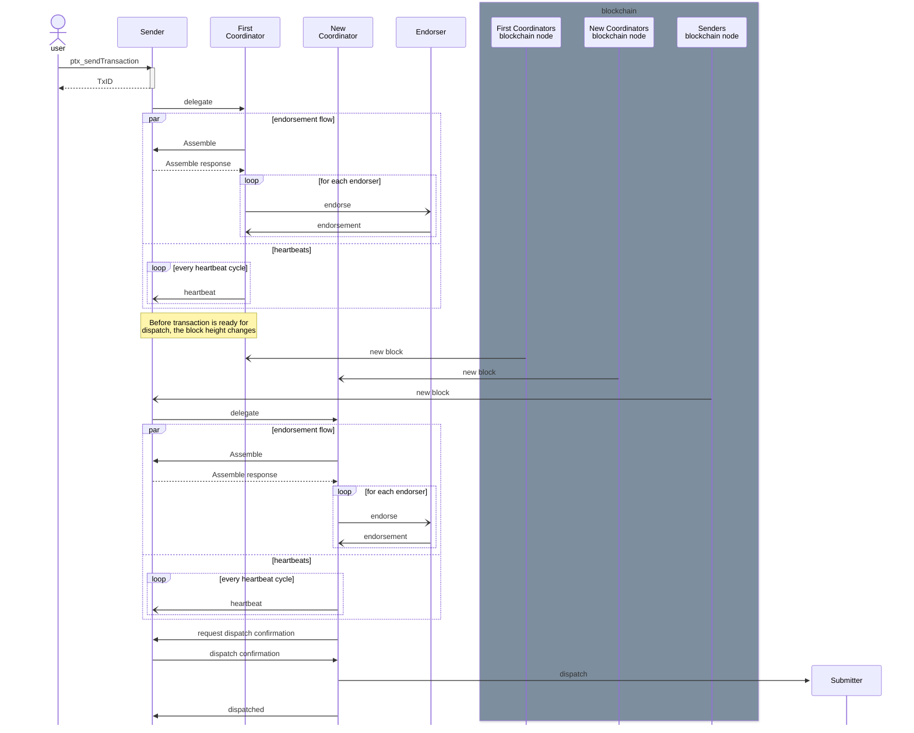
```mermaid
sequenceDiagram
  %%{init: { "sequence": { "mirrorActors":false }}}%%
  actor user
  participant S as Sender
  participant C1 as First <br/> Coordinator
  participant C2 as New <br/> Coordinator
  participant E as Endorser
  box rgba(33,66,99,0.5) blockchain 
    participant BC1 as First Coordinators <br/> blockchain node
    participant BC2 as New Coordinators <br/> blockchain node
    participant BS as Senders <br/>blockchain node
  end

  user->>S: ptx_sendTransaction
  activate S
  S -->> user: TxID
  deactivate S
  S->>C1: delegate
  par endorsement flow
    C1->>S: Assemble
    S-->>C1: Assemble response
    loop for each endorser
      C1 -) E: endorse
      E -) C1: endorsement
    end
  and heartbeats
    loop every heartbeat cycle
      C1 -) S: heartbeat
    end
  end
  Note over S, C1: Before transaction is ready for <br/> dispatch, the block height changes
  BC1 -) C1: new block
  BC2 -) C2: new block
  BS -) S: new block
  
  S->>C2: delegate
  par endorsement flow
    C2->>S: Assemble
    S-->>C2: Assemble response
    loop for each endorser
      C2 -) E: endorse
      E -) C2: endorsement
    end
  and heartbeats
    loop every heartbeat cycle
      C2 -) S: heartbeat
    end
  end
  C2->>S: request dispatch confirmation
  S->>C2: dispatch confirmation
  create participant SB as Submitter
  C2->>SB: dispatch
  C2->>S: dispatched
  
```

#### <a name="senders-responsibility-coordinator-switchover-new-coordinator-behind"></a>Coordinator switchover where the new coordinator is behind on block indexing
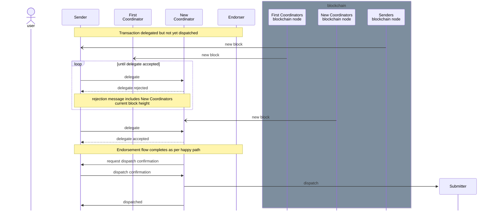
```mermaid

sequenceDiagram
  %%{init: { "sequence": { "mirrorActors":false }}}%%
  actor user
  participant S as Sender
  participant C1 as First <br/> Coordinator
  participant C2 as New <br/> Coordinator
  participant E as Endorser
  box rgba(33,66,99,0.5) blockchain 
    participant BC1 as First Coordinators <br/> blockchain node
    participant BC2 as New Coordinators <br/> blockchain node
    participant BS as Senders <br/>blockchain node
  end

  note over S, E: Transaction delegated but not yet dispatched
  BS -) S: new block
  BC1 -) C1: new block

  loop until delegate accepted
    S->>C2: delegate
    C2-->>S: delegate rejected
    Note over S, C2: rejection message includes New Coordinators <br/> current block height
  end

  BC2 -) C2: new block

  S->>C2: delegate
  C2-->>S: delegate accepted

  note over S, E: Endorsement flow completes as per happy path

  C2->>S: request dispatch confirmation
  S->>C2: dispatch confirmation
  create participant SB as Submitter
  C2->>SB: dispatch
  C2->>S: dispatched
  
```


#### <a name="senders-responsibility-coordinator-switchover-original-coordinator-behind"></a>Coordinator switchover where original coordinator is behind on block indexing
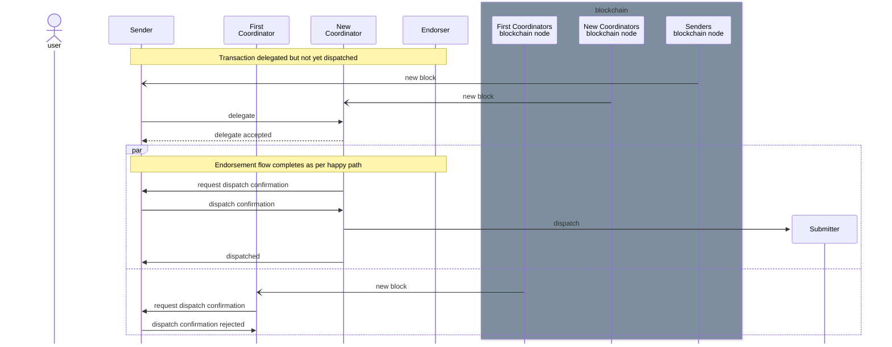
```mermaid

sequenceDiagram
  %%{init: { "sequence": { "mirrorActors":false }}}%%
  actor user
  participant S as Sender
  participant C1 as First <br/> Coordinator
  participant C2 as New <br/> Coordinator
  participant E as Endorser
  box rgba(33,66,99,0.5) blockchain 
    participant BC1 as First Coordinators <br/> blockchain node
    participant BC2 as New Coordinators <br/> blockchain node
    participant BS as Senders <br/>blockchain node
  end

  note over S, E: Transaction delegated but not yet dispatched
  BS -) S: new block
  BC2 -) C2: new block
  
  S->>C2: delegate
  C2-->>S: delegate accepted

  par 
    note over S, E: Endorsement flow completes as per happy path
    C2->>S: request dispatch confirmation
    S->>C2: dispatch confirmation
    create participant SB as Submitter
    C2->>SB: dispatch
    C2->>S: dispatched
  and
    BC1 -) C1: new block 
    C1->>S: request dispatch confirmation
    S->>C1: dispatch confirmation rejected
  end
  
  
```

#### <a name="senders-responsibility-coordinator-switchover-original-sender-behind"></a>Coordinator switchover where Sender is behind on block indexing
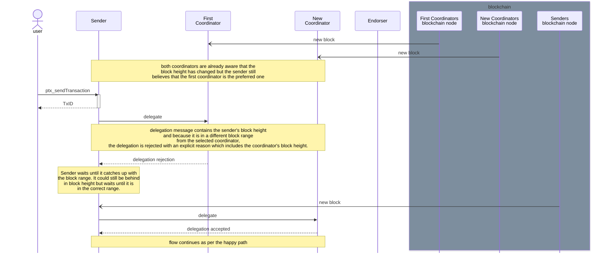
```mermaid

sequenceDiagram
  %%{init: { "sequence": { "mirrorActors":false }}}%%
  actor user
  participant S as Sender
  participant C1 as First <br/> Coordinator
  participant C2 as New <br/> Coordinator
  participant E as Endorser
  box rgba(33,66,99,0.5) blockchain 
    participant BC1 as First Coordinators <br/> blockchain node
    participant BC2 as New Coordinators <br/> blockchain node
    participant BS as Senders <br/>blockchain node
  end

  BC1 -) C1: new block
  BC2 -) C2: new block
  Note over S, C2: both coordinators are already aware that the <br/> block height has changed but the sender still <br/> believes that the first coordinator is the preferred one 
  
  user->>S: ptx_sendTransaction
  activate S
  S -->> user: TxID
  deactivate S
  S->>C1: delegate
  Note over S, C2: delegation message contains the sender's block height <br/> and because it is in a different block range <br/> from the selected coordinator,<br/> the delegation is rejected with an explicit reason which includes the coordinator's block height.
  C1-->>S: delegation rejection
  
  Note over S: Sender waits until it catches up with <br/>the block range.  It could still be behind <br/> in block height but waits until it is <br/>in the correct range.

  BS -) S: new block

  S->>C2: delegate
  C2-->>S: delegation accepted
  Note over S, C2: flow continues as per the happy path
  
```

Theoretically, the sender could trust the response from the first coordinator and delegate to the new coordinator even though the sender itself has not witnessed the blockchain get to that height.  This may be a point of discussion for a future optimization.

#### <a name="senders-responsibility-failover"></a>Failover

Before illustrating the failover scenarios, we shall add some detail to the happy path relating to the persistence points.  Previous diagrams omitted this detail because all activity is controlled by the in-memory view of the state machine and persistence only becomes relevant when we consider the cases where we loose one or more node's in-memory state.

This diagram is annotated ⚠️ with interesting points where a failover could occur

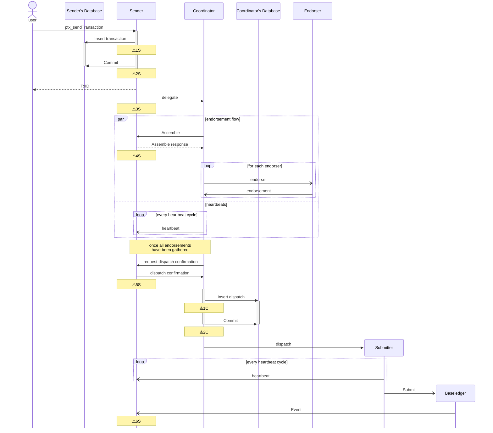
```mermaid
sequenceDiagram
  %%{init: { "sequence": { "mirrorActors":false }}}%%
  actor user
  participant SDB as Sender's Database
  participant S as Sender
  participant C as Coordinator
  participant CDB as Coordinator's Database
  participant E as Endorser
  user->>S: ptx_sendTransaction
  activate S
  S ->> SDB: Insert transaction
  activate SDB
  Note over S: ⚠️1S 
  S ->> SDB: Commit
  deactivate SDB
  Note over S: ⚠️2S 
  deactivate S
  S -->> user: TxID
  
  S->>C: delegate
  Note over S: ⚠️3S 
  par endorsement flow
    C->>S: Assemble
    S-->>C: Assemble response
    Note over S: ⚠️4S 
    loop for each endorser
      C -) E: endorse
      E -) C: endorsement
    end
  and heartbeats
    loop every heartbeat cycle
      C -) S: heartbeat
    end
  end
  Note over S, C: once all endorsements <br/>have been gathered 
  
  C->>S: request dispatch confirmation
  S->>C: dispatch confirmation
  Note over S: ⚠️5S 

  activate C
  C->>CDB: Insert dispatch
  activate CDB
  Note over C: ⚠️1C  
  C->>CDB: Commit
  deactivate CDB
  deactivate C
  Note over C: ⚠️2C 

  %Actually do the dispatch
  create participant SB as Submitter
  C->>SB: dispatch

  loop every heartbeat cycle
    SB -) S: heartbeat
  end


  create participant BL as Baseledger
  SB -) BL: Submit
  BL -) S: Event
  Note over S: ⚠️6S
  
```

#### <a name="senders-responsibility-sender-failover"></a>Sender failover

If the sender restarts, it reads all pending transactions from its database and delegates each transaction to the chosen coordinator for that point in time. This may be the same coordinator that it delegates to previously or may be a new one. The sender holds, in memory, the name of the current coordinator and will only accept a dispatch confirmation from that coordinator.  So if it happens to be the case that it had delegated to a different coordinator before it restarted, then it will reject the dispatch confirmation from that coordinator and that copy of the assembled transaction will be discarded. Noting that this would trigger a re-assembly and re-run of the endorsement flow for any other transactions, including those from other senders, that have been assembled to spend the states produced by the discarded transaction. However, in most likeliness, all other senders will switch their preference to the same new coordinator and trigger a re-do of all non dispatched transactions.

In the case where there is no change in coordinator selection after the failover, this scenario is a simple case of the sender re-loading its pending transactions from persistence and sending a delegation request to the coordinator which is received in an idempotent manner.  The complexities here depends on exactly when the sender restarts. 

**On or before ⚠️1S**

If the sender has restarted at any time before inserting and committing the transaction to its database, then the user never sees a successful response from `ptx_sendTransaction` and will retry.  The retry will be accepted and will be inserted to the database 

**Between ⚠️1S and ⚠️2S**

If the sender crashes after inserting the transaction but before returning a successful response, and new transaction id, then the user will retry.  The retry request will contain the same idempotency key as the initial request and a new transaction will not be inserted but a successful response will be returned with the transaction id.

**Between ⚠️2S and ⚠️6S**

If the sender restarts at any time after inserting and committing the transaction to its database and before finalizing the transaction, then it will re-delegate the transaction.  This is because the sender queries its database for all inflight transactions during [Startup processing](#subprocess_startup) 

The outcome of this re-delegation depends on the state of the coordinator and submitter at this point.

Note the following discussion assumes that the sender acquires no knowledge of the state of the transaction after startup. Exploring the flows with this assumption helps us to understand the robustness of the protocol.  In reality, there is a possibility that the sender receives heartbeat messages from coordinator or submitter early enough to make informed decisions that minimize unnecessary processing.  These details will be explored later when we look at [Startup processing](#subprocess_startup).

**Between ⚠️2S and ⚠️3S**

The sender restarts before sending the initial delegation request, then will delegate after restarting and the flow will continue as per the happy path.

**Between ⚠️3S and ⚠️4S**

If the coordinator had received a delegation request before the sender restarted and the sender restarts and re-sends the delegation request which the coordinator accepts the request in an idempotent manner. 

Assuming the coordinator has not yet dispatched the transaction, It will return a `delegationRequestAccepted` message and will continue to coordinate the transaction as before.

**Between ⚠️4S and ⚠️5S**
If the coordinator had received a `AssembleResponse` before the sender restarted and re-sent the delegation request, then it will not issue another `AssembleRequest`. The coordinator will proceed to gather endorsements for the previously assembled transaction. The consequence of this is that the sender cannot rely on observing the `AssembleRequest` call as an indicator of the state of the transaction flow.

There is a race condition to be aware of here.  If the coordinator hadn't get received the `DispatchConfirmation` response before the sender crashed, then there is a possibility that the sender will receive a `DispatchConfirmation` request before it has delegated the transaction. As far as the protocol is concerned, it is valid for the sender to respond with `DispatchConfirmationError` in this case. This causes disruption and extra processing relating to this transaction and any dependencies.  However, as an optimization, it is also valid for the sender to detect that the `DispatchConfirmation` relates to a transaction that has no current active delegate and decide to defer the `DispatchConfirmation` until it has triggered a `DelegationRequest` and received `DelegationRequestAccepted`.

**Between ⚠️5S and ⚠️6S**
If the coordinator had already received a confirmation to dispatch the transaction, then it will proceed to do so in parallel to accepting the delegation request in an idempotent manner.

The sender will not receive another `DispatchConfirmation` request.

The state of the transaction lifecycle goes through various transitions between ⚠️5S and ⚠️6S on the coordinator and submitter side.  However, from the perspective of a newly restarted sender, the precise point at which it re sends the delegation request is irrelevant. In all cases, the sender relies on heartbeat messages from the coordinator and submitter and ultimately on blockchain events to track the progress of the transaction.


<!-- TODO the above discussion might be easier in the context of a transaction state diagram instead or ( or complimentary to ) the sequence diagram -->

The case where the sender selects a different coordinator after it restarts is no different to the case where the sender selects a new coordinator without a restart.  Whether that is because of a new block range or because the old coordinator is no longer available.  The fact that the sender has "forgotten" that it had previously delegate to a different coordinator does not change anything.  In the non-restart cases, the sender does not send any communications to the original coordinator ( i.e. it makes no attempt to actively claw back the delegation) - although doing so may be a subject for discussion on future optimization.  The only impact of the coordinator switch is when the original coordinator requests permission to dispatch.  It will be rejected because the sender has an in-memory record that it has delegate to the new coordinator which is exactly the same situation whether the sender had restarted before doing so or not.

#### <a name="senders-responsibility-coordinator-failover"></a>Coordinator failover


When the coordinator restarts, it will continue to send heartbeat messages but those messages only contain the transaction ids for the transactions that were delegated to it since restart.  For any pending transactions that were previously delegated to it, when the sender of those transactions receives the heartbeat message and realizes the that coordinator has "forgotten" about the transaction, then the sender re-sends the delegation request for those transactions.

<!-- TODO this section is written from the perspective of the coordinator but it would be more helpful to write it in terms of how the senders responsibilities and behavior result in successful transaction processing even when the coordinator fails over -->
From the perspective of the coordinator if it restarts on or before point ⚠️1C, then it is as if it has never seen any delegation for that transaction.  It may or may not get a new delegation depending on whether the sender selects that same coordinator by the time it realizes that this coordinator is no longer actively coordinating that transaction.

If it restarts on or after point ⚠️2C then it will continue to dispatch the transaction to the submitter.

NOTE: all of the above discussion assumes that there is a timely recovery in the case of failover.  If the coordinator fails and does not recover in a timely manner, then that is a similar scenario to the coordinator becoming unavailable.

**Assured once only confirmed transaction per intent**
The sender makes every effort to ensure that only one transaction is submitted to the base ledger for any given user request but it is impossible for the sender to guarantee that so the algorithm relies on validation on the base ledger contract that no transaction `intent` will be confirmed more than once.

#### <a name="senders-responsibility-coordinator-becomes-unavailable"></a>Coordinator becomes unavailable

If the sender stops receiving heartbeat messages from the coordinator, then it assumes that the coordinator has become unavailable.  However it may actually be the case that the coordinator is still running and just that the network between the coordinator and the sender has a fault.  The action of the sender for each inflight transaction depends on exactly which stage of the flow the sender believes that transaction to be.  The consequence of the sender's action depend on whether the previous coordinator is still operating and where in the flow it believes the transaction to be.  Scenarios to explore are:

  1.  sender detects that the heartbeats have stopped before it has sent a response to a dispatch confirmation request.  In this case, the sender retries the whole [handle transaction process](#subprocess-handle-transaction) that beings with [select available coordianator](#subprocess-select-available-coordinator).  That will initially attempt to delegate to the preferred coordinator and then fall back to alterative coordinators if needed. 
  2.  sender detects that the heartbeats have stopped after it has sent a response to a dispatch confirmation request but before it has received any heartbeat messages from the submitter. In this case, the sender responds in the same way to when the [submitter becomes unavailable](#senders-responsibility-submitter-becomes-unavailable)
  


#### <a name="senders-responsibility-submitter-becomes-unavailable"></a>Submitter becomes unavailable
<!-- TODO add sequence diagram and description-->

### Complete sequence diagram

All of the above combined into a single diagram with links to the details description for each message exchange and the processing that each message triggers on the receiving node.

TBD: not sure if this should be kept but it is useful as a TODO list for writing the detail protocol points

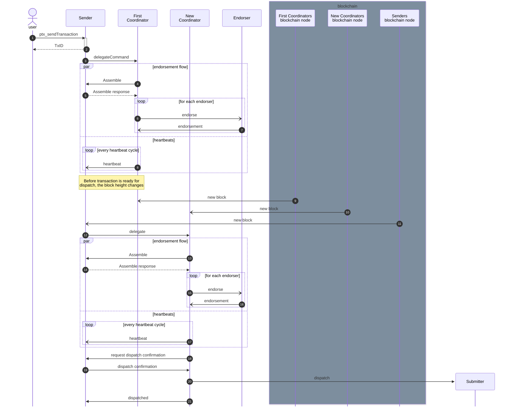
```mermaid
sequenceDiagram
  %%{init: { "sequence": { "mirrorActors":false }}}%%
  autonumber
  actor user
  participant S as Sender
  participant C1 as First <br/> Coordinator
  participant C2 as New <br/> Coordinator
  participant E as Endorser
  box rgba(33,66,99,0.5) blockchain 
    participant BC1 as First Coordinators <br/> blockchain node
    participant BC2 as New Coordinators <br/> blockchain node
    participant BS as Senders <br/>blockchain node
  end

  user->>S: ptx_sendTransaction
  activate S
  S -->> user: TxID
  deactivate S
  S->>C1: delegateCommand

  par endorsement flow
    C1->>S: Assemble
    S-->>C1: Assemble response
    loop for each endorser
      C1 -) E: endorse
      E -) C1: endorsement
    end
  and heartbeats
    loop every heartbeat cycle
      C1 -) S: heartbeat
    end
  end
  Note over S, C1: Before transaction is ready for <br/> dispatch, the block height changes
  BC1 -) C1: new block
  BC2 -) C2: new block
  BS -) S: new block
  
  S->>C2: delegate
  par endorsement flow
    C2->>S: Assemble
    S-->>C2: Assemble response
    loop for each endorser
      C2 -) E: endorse
      E -) C2: endorsement
    end
  and heartbeats
    loop every heartbeat cycle
      C2 -) S: heartbeat
    end
  end
  C2->>S: request dispatch confirmation
  S->>C2: dispatch confirmation
  create participant SB as Submitter
  C2->>SB: dispatch
  C2->>S: dispatched
```

## Protocol points

To understand the detailed specification of the responsibilities and expectations of each node in the network, we explore the detail of message formats, message exchange handshake and processing related to the handling of specific messages.  We start with an overview of some common message exchange patterns before drilling down to the detailed concrete specification of messages and their handlers.

### Common message exchange patterns
All messages contain the following fields:

  - `protocolVersion` semver version number that can be used to determine whether the software version running the sender and receiver nodes are compatible with each other.
  - `messageID` unique id for every message.

Reply messages also contain

  - `CorrelationID` this is a copy of the `MessageID` of the message that this reply corresponds to.

These can be used by the transport layer plugins to exploit qualities of service capabilities of the chosen transport. 

In addition to these, the distributed sequencer protocol defines some common message exchange patterns that provide delivery assurances and correlation in the context of the handshakes described in the protocol walkthrough above.

<!-- TBD: `CorrelationID` is not currently used in the implementation.  Should we remove this or redefine its behavior (i.e. to be a copy of the `RequestID`) or leave it as an option for the transport plugin to use? -->

#### Assured delivery

In some cases, it important for one party to have some assurance that the other party has received a message and has triggered an action based on that message.  The action may be to store the message in a persistent store or may be to trigger some in memory process.  
The approach to achieving assured delivery is to define message exchange patterns where the messages are expected to be reciprocated with some form of acknowledgment.

Messages sent with an assured delivery expectation have an additional field that is unique to the intent of the message but unlike the `MessageID` is not necessarily unique for every message.  This allows the sender to idempotenty resend the message in lieu of any acknowledgment and achieve and `at least` once assurance. Each resend would be a different `MessageID` therefore allowing the transport layer to assume that `MessageID` is unique and avoid the transport layer from discarding the retry message as a duplicate.
 
There are three patterns of exchange that provide assured delivery that we shall explore in detail below

 - `ReliableNotification`
 - `Command` / `CommandAccepted` / `CommandRejected`
 - `Request` / `Response` / `Error`

#### Non assured delivery

In some cases, assured delivery is not necessary and simple datagram message exchange pattern is sufficient.  In those cases, typically to comminute point in time status messages ( e.g. heartbeat), if a message is lost, there is no loss in data and the correct status will be communicated via the next message that does manage to reach its destination. 

#### Reliable notification 
The `Reliable notification` message exchange pattern involves 2 parties

 - notification sender
 - notification receiver

The `notification sender` sends a `Notification` message and will continue to resend periodically until it has received an `Acknowledgment` from the notification receiver.

From the receiver's perspective, a reliable notification is idempotent.  The state of the receiver must not differ when it receives multiple notifications with matching notification id.  The receiver must send an acknowledgment when it successfully receives a notification, even if it has already sent an acknowledgment for a previous notification with the same notification id.

From the sender's perspective, an acknowledgement to a reliable notification is idempotent. The state of the sender must not differ when it receives multiple acknowledgment with matching notification ids.  It must stop resending notifications with that notification id when it receives at least one acknowledgment and it must tolerate receiving further acknowledgements for that same notification id. 


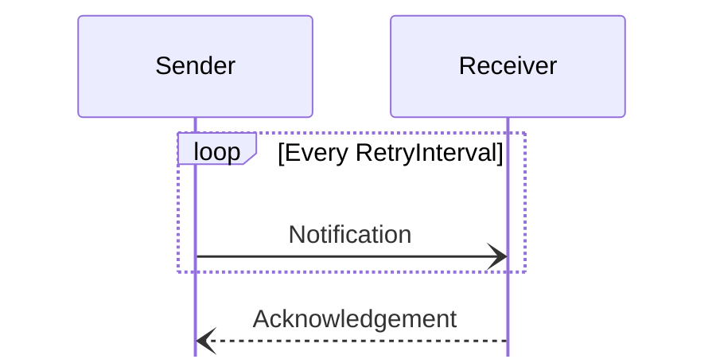
```mermaid
sequenceDiagram
  %%{init: { "sequence": { "mirrorActors":false }}}%%
  participant S as Sender
  participant R as Receiver
  loop Every RetryInterval
    S -) R: Notification
  end
  R --) S: Acknowledgement
```

#### Assured delivery data distribution

This pattern combines the `ReliableNotification` pattern with a persistence layer on both nodes to achieve assured eventual consistency between the data stores.

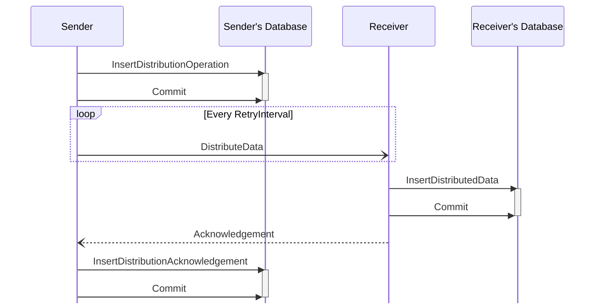
```mermaid
sequenceDiagram
  %%{init: { "sequence": { "mirrorActors":false }}}%%
  
  participant S as Sender
  participant SDB as Sender's Database
  participant R as Receiver
  participant RDB as Receiver's Database
  S->>SDB: InsertDistributionOperation
  activate SDB
  S->>SDB: Commit
  deactivate SDB
  loop Every RetryInterval
    S -) R: DistributeData
  end
  R->>RDB: InsertDistributedData
  activate RDB
  R->>RDB: Commit
  deactivate RDB
  
  R --) S: Acknowledgement

  S->>SDB: InsertDistributionAcknowledgement
  activate SDB
  S->>SDB: Commit
  deactivate SDB
  
```

#### Command 
The `Command` message exchange pattern involves 2 parties

 - command sender
 - command receiver

The `command sender ` sends a `ReliableMessage` containing information about the command and will continue to resend periodically until it has received either a  `CommandAccepted` or `CommandRejection` message.

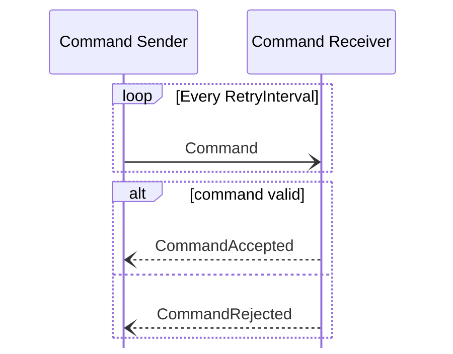
```mermaid
sequenceDiagram
  %%{init: { "sequence": { "mirrorActors":false }}}%%
  participant S as Command Sender
  participant R as Command Receiver
  loop Every RetryInterval
    S -) R: Command
  end
  alt command valid
    R --) S: CommandAccepted
  else
    R --) S: CommandRejected
  end
```

The reliable command pattern is used to assure that the sequencer code running in the other node's memory space has received the command and does not give any assurance to the persistence of that command. Theoretically, a this pattern could be combined with database persistence to provide that assurance. However, currently there are not cases of that in the protocol.

Typically, the `Reliable command` pattern is combined with `Reliable notification` pattern to feedback to the `command sender` when the command has been completed or aborted.  But this is not always the case.

#### Request
The `Request` message exchange pattern involves 2 parties

 - request sender
 - request receiver

The `request sender ` sends a `Request` containing a query for some data continue to resend the request periodically until it has received either a  `RequestResponse` containing the requested data or a `RequestError` message containing the reason for the error.

The sender will resend the request periodically until it receives a response or an error.

From the perspective of the receiver, the request may be treated as idempotent.  If it has already sent a response to a request with the same request id, then it must send another response (or error). In this case the request receiver may sent the exact same response as previously but may alternatively send a different response.  In other words, there is no obligation on the request receiver to remember exactly what requests it has responded to and what those responses were.  It must however always send a valid response or error.  In cases where the request receiver has received  and responded to multiple copies of the same request ( matching request id), there is no guarantee which of the responses will be consumed by the request sender.

From the perspective of the request sender, only one request response should be consumed and all other should be ignored.  If an error is received and the reason for the error is a transient one, there is no guarantee that sending the same request (matching request id) in future will result in a different response.  The retry protocol is intended to mitigate unreliability at the network transport layer ( i.e. when no response is received).  To retry in the case of other transient error's, a new request (i.e. a message with a different request id) must be initiated. 

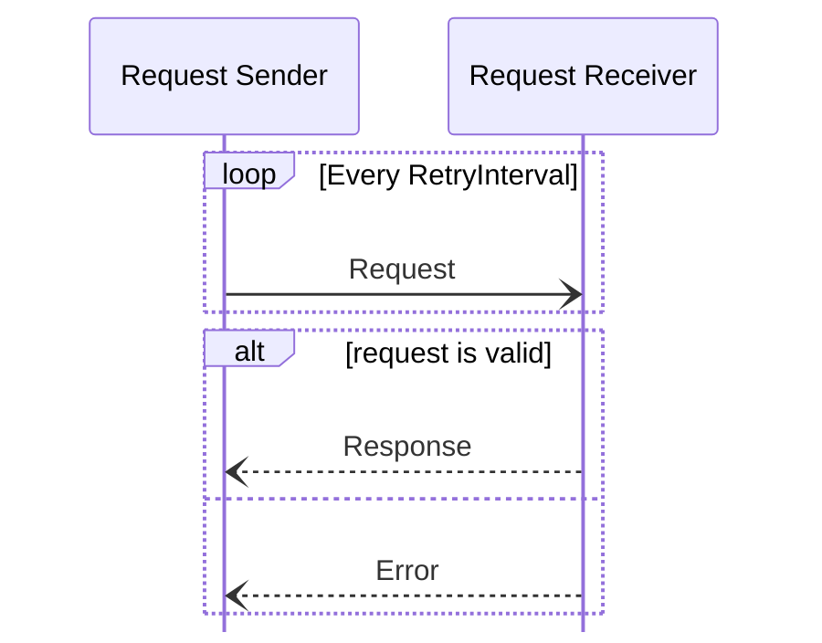
```mermaid
sequenceDiagram
  %%{init: { "sequence": { "mirrorActors":false }}}%%
  participant S as Request Sender
  participant R as Request Receiver
  loop Every RetryInterval
    S -) R: Request
  end
  alt request is valid
    R --) S: Response
  else
    R --) S: Error
  end
```

### Message specification and handler responsibilities

The following concrete message exchanges defines the responsibilities and expectation of each node in the network:

 - <a href="#message-exchange-delegation">Transaction delegation</a>
 - <a href="#message-exchange-assemble">Transaction assemble</a>
 - <a href="#message-exchange-endorsement">Transaction endorsement</a>
 - <a href="#message-exchange-coordinator-heartbeat">Coordinator heartbeat</a>
 - <a href="#message-exchange-submitter-heartbeat">Submitter heartbeat</a>
 - <a href="#message-exchange-startup">Startup</a>
 - <a href="#message-exchange-dispatch-confirmation">Dispatch confirmation</a>
 - 

#### <a name="message-exchange-delegation"></a>Transaction delegation

This is an instance of the `Command` pattern where the `command sender` is the sender node for the given transaction and the `command receiver` is the node that has been chosen, by the `sender` as the `coordinator`.  The `sender` sends a `DelegationCommand` message...

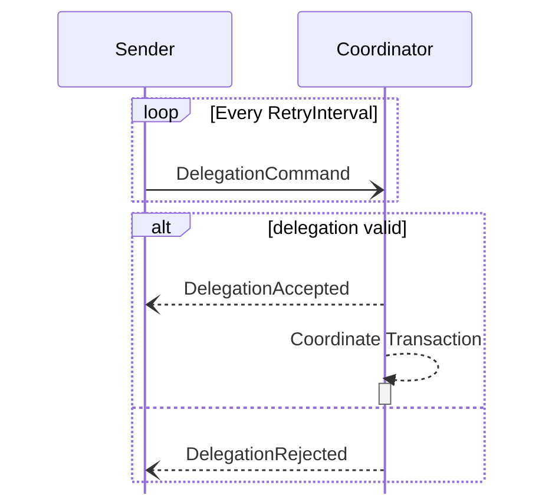
```mermaid
sequenceDiagram
  %%{init: { "sequence": { "mirrorActors":false }}}%%
  participant S as Sender
  participant C as Coordinator
  loop Every RetryInterval
    S -) C: DelegationCommand
  end
  alt delegation valid
    C --) S: DelegationAccepted
    C -->> C: Coordinate Transaction
    activate C
    deactivate C
  else
    C --) S: DelegationRejected
  end
  
```


##### <a name="message-transaction-delegation-command"></a>Delegation Command

```proto
message DelegationCommand {
    string transaction_id = 1;
    string delegate_node_id = 2;
    string delegation_id = 3; //this is used to correlate the acknowledgement back to the delegation. unlike the transport message id / correlation id, this is not unique across retries
    repeated bytes private_transactions = 4; //json serialized copy of the in-memory private transaction objects
    int64 block_height = 5; // the block height upon which this delegation was calculated (the highest delegation wins when crossing in the post)
}
```

As a member of the coordinator committee, a node that receives a `DelegationCommand` must either respond by sending `DelegationAccepted` or `DelegationRejected` message.  

Valid reasons for rejection are
 - requesters block height is in a different block range than expected.  In this case, the `DelegationRejected` message must contain the block height that the local node is aware of so that the delegating node can make an informed decision based on whether they are behind or ahead.
 - the current node is not the most preferred available coordinator for the current block height.

If the Delegation is accepted, then the receiving node must begin [coordinating](#subprocess-coordinate-transaction) those transactions

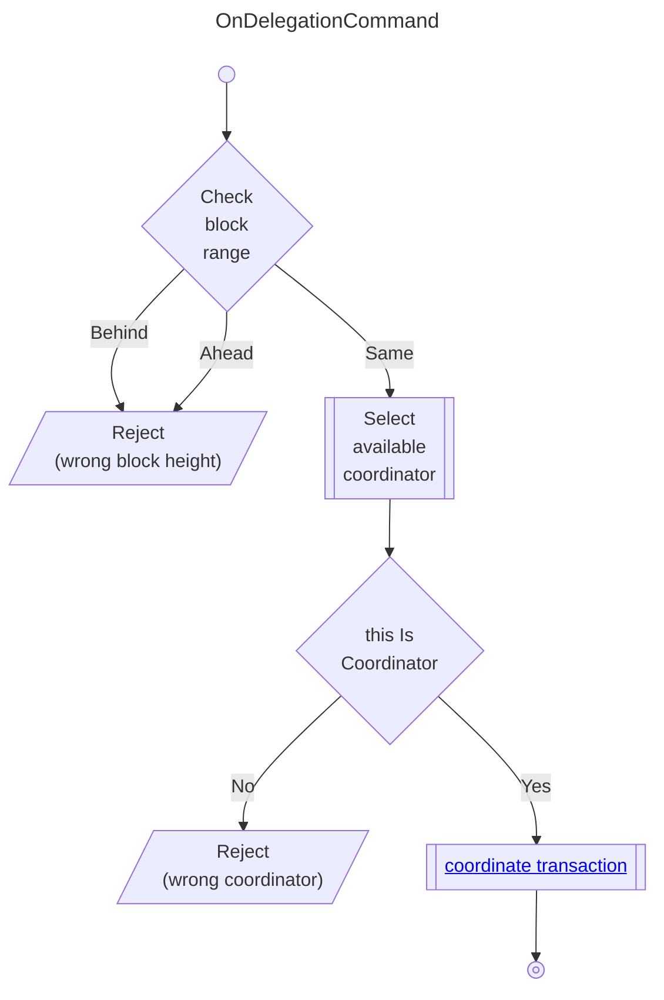
```mermaid
---
title: OnDelegationCommand
---
flowchart TB
    A@{ shape: sm-circ, label: "Start" }
    B@{ shape: diam, label: "Check <br/>block<br/>range" }
    C@{ shape: lean-r, label: "Reject<br/>(wrong block height)" }
    D@{ shape: fr-rect, label: "Select<br/>available<br/>coordinator" }
    E@{ shape: diam, label: "this Is<br/>Coordinator" }
    I@{ shape: lean-r, label: "Reject<br/>(wrong coordinator)" }
    G@{ shape: fr-rect, label: "<a href="#subprocess-coordinate-transaction">coordinate transaction</a>" }
    J@{ shape: fr-circ, label: " " }


    A-->B
    B --> |Behind| C
    B --> |Ahead| C
    B --> |Same| D
    D --> E
    E --> |Yes| G
    E --> |No| I
    G --> J
```
<!--
TODO include flow chart include the sending of the startup message
-->

##### <a name="message-transaction-delegation-rejected"></a>Transaction delegation rejected

The handling of a delegation rejected message depends on the reason for rejection.

 - if the reason is `MismatchedBlockHeight` and the target delegate is ahead then a new delegation request is sent once the sender has reached a compatible block height.  Compatible block height is defined as a block height in the same block range. 
 - if the reason is `MismatchedBlockHeight` and the target delegate is behind then a new delegation request is sent on a periodic interval until it is accepted or rejected with a different reason
 - if the reason is `NotPreferredCoordinator` the `SendTransaction` process is reset

```proto
message DelegationRequestRejected {
    string transaction_id = 1;
    string delegate_node_id = 2;
    string delegation_id = 3;
    string contract_address = 4;
    DelegationRequestRejectedReason reject_reason = 5;
    optional MismatchedBlockHeightDetail mismatchedBlockHeightDetail = 6; //included if reject_reason is "MismatchedBlockHeight"
    optional NotPreferredCoordinatorDetail notPreferredCoordinatorDetail = 7; //included if reject_reason is "NotPreferredCoordinator"
}

enum DelegationRequestRejectedReason{
  MismatchedBlockHeight = 0;
  NotPreferredCoordinator = 1;
}

message MismatchedBlockHeightDetail {
  int64 provided_block_height = 1;
  int64 observed_block_height = 2;
}

message NotPreferredCoordinatorDetail {
  string preferred_coordinator = 1;
  google.protobuf.Timestamp latest_heartbeat_time = 2;
  string latest_heartbeat_id = 3;
}

```

##### <a name="message-transaction-delegation-accepted"></a>Transaction delegation accepted

If a node receives a `DelegationAccepted` message then it should start to monitor the continued acceptance of that delegation.  It can expect to receive `CoordinatorHeartbeatNotification` messages from the delegate node and for those messages to include the id of the delegated transaction. The `sender` node cannot assume that the `coordinator` node will persist the delegation request.  If the heartbeat messages stop or if the received heartbeat messages do not contain the expected transaction ids, then the sender should retrigger the `HandleTransaction` process to cause the transaction to be re-delegated either to the same delegate, or new delegate or to be coordinated by the sender node itself. Whichever is appropriate for the current point in time.  

```proto
message DelegationRequestAccepted {
    string transaction_id = 1;
    string delegate_node_id = 2;
    string delegation_id = 3;
    string contract_address = 4;
}
```

#### <a name="message-exchange-transaction-assemble"></a>Transaction Assemble

This is an instance of the `Request` pattern where the `request sender` is the coordinator node for the given transaction and the `request receiver` is the sender node.

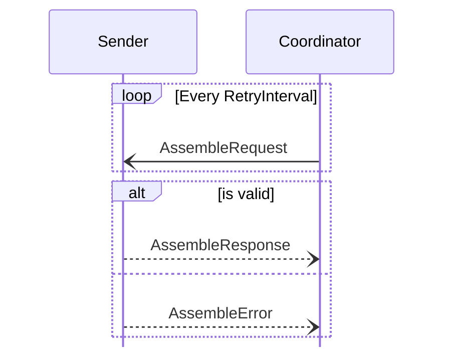
```mermaid
sequenceDiagram
  %%{init: { "sequence": { "mirrorActors":false }}}%%
  participant S as Sender
  participant C as Coordinator
  loop Every RetryInterval
    C -) S: AssembleRequest
  end
  alt is valid
    S --) C: AssembleResponse
  else
    S --) C: AssembleError
  end
```  

Given that a node (referred to as `sender`) has delegated a transaction to another node (referred to as `delegate`) and hasn't since re-delegated that transaction for any reason to any other node, when the `sender` node receives an `AssembleRequest` message from the `delegate` then it should invoke the relevant domain code, with a domain context containing the state locks from the `AssembleRequest` message, sign the resulting payload and send an `AssembleResponse` message to the `delegate`.

The `sender` should send an `AssembleError` message if it is unable to successfully assemble and sign the transaction for any reason.

If no `AssembleResponse` or `AssembleError` message is received by the coordinator after the `assembleTimeout` period, then the coordinator may abandon this transaction or make another attempt to re-assemble it, at a later time, potentially with a new domain context.

The `sender` node must not assume that a successful `AssembleResponse` will be the final assemble of that transaction.  If further `AssembleRequest` messages are received then the `sender` must fulfil those in a timely manner otherwise the  `coordinator` may stop coordinating that transaction.

If the `AssembleRequest` does not correspond to an inflight transaction for that `sender` node then the sender must send a `AssembleError` message to the coordinator node.
If the `AssembleRequest` does no correspond to the active delegation for the given transaction, then the `sender` node must send an `AssembleError` to the coordinator node.


A note on "active delegation" vs "inflight transaction":  A given transaction is determined to be `in-flight` if the sender has received a `ptx_sendTransaction(s)` or `ptx_prepareTransaction(s)` call from the user and the transaction has not yet been dispatched to the submitter or prepared and distributed back to the sender.  While a transaction is in-flight, it may be the subject of multiple delegations but only one of those delegations are considered as `active` at any point in time.  For example, the sender node may detect that the coordinator has gone offline and will then create a new delegation for an alternative coordinator.


##### <a name="message-assemble-request"></a>Assemble request

```proto
message AssembleRequest {
    string transaction_id = 1;
    string assemble_request_id = 2;
    string contract_address = 3;
    bytes transaction_inputs = 4;
    bytes pre_assembly = 5;
    bytes state_locks = 6;
    int64 block_height = 7;
    string delegation_id = 8;
}
```

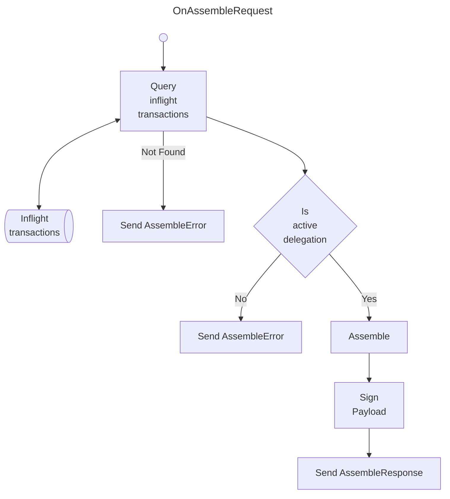
```mermaid
---
title: OnAssembleRequest
---
flowchart TB
    A@{ shape: sm-circ, label: "Start" }
    B@{ shape: h-cyl, label: "Inflight<br/>transactions" }
    C@{ shape: rect, label: "Query<br/>inflight<br/>transactions" }
    D@{ shape: rect, label: "Send AssembleError" }
    E@{ shape: diam, label: "Is<br/>active<br/>delegation" }
    F@{ shape: rect, label: "Send AssembleError" }
    G@{ shape: rect, label: "Assemble" }
    H@{ shape: rect, label: "Sign<br/>Payload" }
    I@{ shape: rect, label: "Send AssembleResponse" }

    A --> C
    C <--> B
    C --> |Not Found| D
    C --> E
    E --> |No| F
    E --> |Yes| G
    G --> H
    H --> I
```

##### <a name="message-assemble-response"></a>Assemble response

```proto
message AssembleResponse {
    string transaction_id = 1;
    string assemble_request_id = 2;
    string contract_address = 3;
    bytes post_assembly = 4;
}
```

##### <a name="message-assemble-error"></a>Assemble error

```proto
message AssembleError {
    string transaction_id = 1;
    string assemble_request_id = 2;
    string contract_address = 3;
    string error_message = 4;
}
```

If a coordinator receives an `AssembleError` then it must stop coordinating that transaction.  It is the responsibility of the sender node to decide whether to finalize the transaction as `failed` or to retry at a later point in time.

#### <a name="message-exchange-endorsement"></a>Transaction endorsement


This is an instance of the `Request` pattern where the `request sender` is the coordinator node for the given transaction and the `request receiver` is one of the required endorsers.

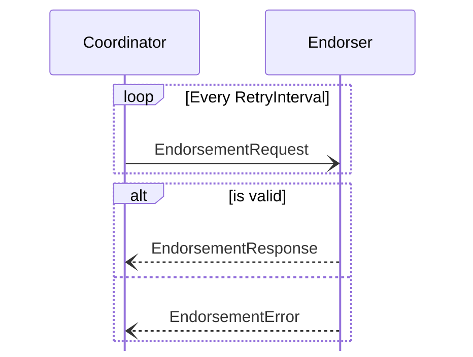
```mermaid
sequenceDiagram
  %%{init: { "sequence": { "mirrorActors":false }}}%%
  participant C as Coordinator
  participant E as Endorser
  loop Every RetryInterval
    C -) E: EndorsementRequest
  end
  alt is valid
    E --) C: EndorsementResponse
  else
    E --) C: EndorsementError
  end
```  

As a member of the endorsement committee for a domain instance, whenever a node receives an `Endorsement request` it must respond, with either an `EndorsementResponse` or `EndorsementError`.

##### <a name="message-endorsement-request"></a>Endorsement request

```proto
message EndorsementRequest {
    google.protobuf.Any attestation_request = 1;
    string idempotency_key = 2;
    string transaction_id = 3;
    string contract_address = 4;
    string party = 5;
    google.protobuf.Any transaction_specification = 6;
    repeated google.protobuf.Any verifiers = 7;
    repeated google.protobuf.Any signatures = 8;
    repeated google.protobuf.Any inputStates = 9;
    repeated google.protobuf.Any readStates = 10;
    repeated google.protobuf.Any outputStates = 11;
    repeated google.protobuf.Any infoStates = 12;
}
```

<!--
TODO include flow chart including the sending of the startup message
-->

##### <a name="message-endorsement-response"></a>Endorsement response

```proto
message EndorsementResponse {
    string transaction_id = 1;
    string idempotency_key = 2;
    string contract_address = 3;
    optional google.protobuf.Any endorsement = 4;
    string party = 5;
    string attestation_request_name = 6;
}
```

##### <a name="message-endorsement-response"></a>Endorsement error

When a coordinator receives a `EndorsementError` it must remove that transaction, and any dependant transactions from the current graph of assembled transactions and queue them up for re-assembly.

```proto
message EndorsementError {
    string transaction_id = 1;
    string idempotency_key = 2;
    string contract_address = 3;
    optional string revert_reason = 4;
    string party = 5;
    string attestation_request_name = 6;
}
```

#### <a name="message-exchange-coordinator-heartbeat"></a>Heartbeat

Once a `coordinator` node has accepted a delegation, it will continue to periodically send `CoordinatorHeartbeatNotification` messages to the `sender` node for that transaction. The coordinator sends a heartbeat notification to all nodes in the privacy group.  The message sent to any given node must include the ids for all active delegations. The message may contain other delegation ids that are unknown to the receiving node.

This is a fire and forget notification.  There is no acknowledgement expected.


```mermaid
sequenceDiagram
  %%{init: { "sequence": { "mirrorActors":false }}}%%
  participant C as Coordinator
  participant S1 as Sender 1
  participant S2 as Sender 2
  loop Every `HeartBeatInterval`
    C -) S1: Heartbeat
    C -) S2: Heartbeat
  end
  
```  


##### <a name="message-coordinator-heartbeat-notification"></a>Coordinator heartbeat notification

When a node receives a heartbeat message from a coordinator node, it should compare that notification with its record of inflight transactions and active delegations
 - if the receiving node has any in flight transactions that have been delegated to coordinators other than the source of the received heartbeat, then the receiving node should initiate a re-evaluation of its choice of coordinator

```proto
message CoordinatorHeartbeatNotification {
    string heartbeat_id = 1;
    google.protobuf.Timestamp timestamp = 2;
    string contract_address = 3;
    repeated string transaction_ids = 4;
}
```

<!-- 
TODO add flow chart to show how the different conditions are handled
  - heartbeat received as expected
  - heartbeat received from a different coordinator than expected which has a higher preference ranking
  - heartbeat received from a different coordinator than expected which has a lower preference ranking
  - heartbeat received from expected coordinator but does not include all transactions expected
  - no heartbeat received after a time threshold
-->


#### <a name="message-exchange-submitter-heartbeat"></a>Heartbeat

Once a `submitter` node has accepted a dispatch, it will continue to periodically send `SubmitterHeartbeatNotification` messages to the `sender` node for that transaction. The submitter sends a heartbeat notification to all nodes for which it is currently submitting transactions.  The message sent to any given node must include the submissions and activity for all transactions that node is a sender of as well as the transaction ids for all transactions.

This is a fire and forget notification.  There is no acknowledgement expected.

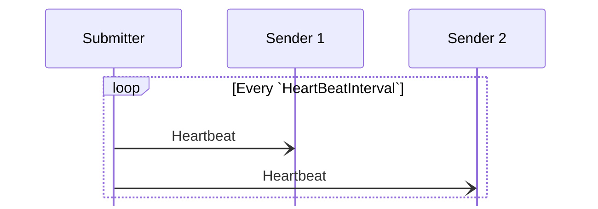
```mermaid
sequenceDiagram
  %%{init: { "sequence": { "mirrorActors":false }}}%%
  participant S as Submitter
  participant S1 as Sender 1
  participant S2 as Sender 2
  loop Every `HeartBeatInterval`
    S -) S1: Heartbeat
    S -) S2: Heartbeat
  end
  
```  

##### <a name="message-submitter-heartbeat-notification"></a>Submitter heartbeat notification

When a node receives a heartbeat message from a submitter, it should compare that notification with its record of inflight transactions and active delegations and use the information from the heartbeat message to update its in-memory record of that transaction which then influences future decisions / responses to other events.

  - while recent submitter heartbeat notifications have been received, the sender should not delegate the transaction to other coordinators, even if block height moves into a new range
  - while recent submitter heartbeat notifications have been received for any transactions in a given contract address, and the coordinator block range for those transactions is previous to the current coordinator block range, then the sender should not delegate any transactions to the new coordinator for the current block range

```proto

message Submission {
  google.protobuf.Timestamp time = 1 ;
  string transactionHash = 2 ;
  string gasPrice = 3 ;
}

message SubmitterActivity {
  google.protobuf.Timestamp time = 1 ;
  string message = 2 ; 
}

message DispatchedTransaction {
  string transaction_id = 1 ;
  repeated Submission submissions = 2 ;
  repeated SubmitterActivity activity = 3 ;
}

message SubmitterHeartbeatNotification {
    string heartbeat_id = 1;
    google.protobuf.Timestamp timestamp = 2;
    string contract_address = 3;
    repeated string transaction_ids = 4;
}
```

<!-- TODO should the heartbeat contain such rich information about the `submissions` and `activity` for every transaction?  Or should there be a separate acknowledged notification message for these significant activity events  and that they should update the persistent state?  -->


#### <a name="message-exchange-startup"></a>Startup

<!--
TBD: is `startup` / `startup message` the best term for this protocol point? It is relevant for node process startup time but is also relevant for any period of time after the node started until the first time it detects activity in a particular privacy group.  The protocol does not define a limit on this period so it could be a very long time.  
Is is also valid for a spec compatible node to swap out of memory inactive privacy groups and when it does detect activity on a given privacy group, it cannot distinguish whether it has been active in that group since the last restart and will then send the startup message.  So maybe there is a better name than `startup` to reflect this.
-->

This is an instance of the `Reliable Notification` message exchange pattern where the sender of the notification is a node that was previously inactive with respect to a particular privacy group and the receiver of the notification is each of the other nodes in that group.

Given that a node is currently inactive with respect to a privacy group that it is a member of, when that node detects any activity on that privacy group, then it sends a `startup message` to all other members of the privacy group. 

Given that a node has some active delegations sent to any node that was not the preferred coordinator, when it receives a `startup message` from another node then it considers whether the node sending the `startup` message is more preferred as a coordinator than the current selected coordinator. When a node receives a startup message, then it sends an acknowledgment.

For details on the processes that trigger a `startup message` to be sent, see:

 - [OnTransactionConfirmation](#message-exchange-transaction-confirmation)
 - [OnDelegationCommand](#message-transaction-delegation-command)
 - [OnEndorsementRequest](#message-endorsement-request)


Differences between Startup messages and heartbeat messages

- the sender of a startup message is not making any presumption or assertion that it should be the chosen coordinator.  In some cases a node can easily determine that it is the preferred coordinator (i.e. the hashring function places it closest for the current block range) however, there are cases where it would need to test the availability of other nodes in the network to determine that it is more preferred than other available nodes.  So the start up processing does not attempt make that decision and simply sends a startup message to members of any active privacy groups.
 - start up messages are a one time message so they need to be acknowledged whereas heart beat messages are fire and forget because they are re-sent at periodic intervals 
 - 

##### <a name="message-startup-notification"></a> Startup notification message

```proto
message StartupNotification {
    string startup_id = 1;
    google.protobuf.Timestamp timestamp = 2;
    string contract_address = 3;
}
```

```mermaid
---
title: OnStartupNotification
---
flowchart TB
    A@{ shape: sm-circ, label: "Start" }
    B@{ shape: lean-r, label: "Send startup<br/>notification acknowledgment" }
    C@{ shape: diam, label: "If<br/>active<br/>sender" }
    D@{ shape: fr-rect, label: "Reevaluate<br/>active<br/>delegations" }
    E@{ shape: fr-circ, label: " " }

    A --> B
    B --> C
    C --> |Yes| D
    C --> |No| E
    D --> E

    
```

##### <a name="message-startup-notification-acknowledgment"></a> Startup notification acknowledgment message
```proto
message StartupNotificationAcknowledgement {
    string startup_id = 1;
}
```

#### <a name="message-exchange-dispatch-confirmation"></a>Dispatch confirmation

When a coordinator has gathered all required endorsements for a transaction and there are no dependant transactions still waiting to be endorsed, then the coordinator must request confirmation of dispatch from the sender of the transaction. This step is not strictly necessary to achieve data integrity but it does help to mitigate situations where the delegation had been rescinded and a transaction delegated to another coordinator without the initial coordinator being aware of that. If this confirmation is not sought, then there is a possibility that the coordinator will cause the submitter and / or another coordinator / submitter to perform wasteful processing submitting a transaction that will revert on the base ledger as a duplicate.

```mermaid
sequenceDiagram
  %%{init: { "sequence": { "mirrorActors":false }}}%%
  participant C as Coordinator
  participant S as Sender
  loop Every RetryInterval
    C -) S: RequestDispatchConfirmation
  end
  alt request is valid
    S --) C: DispatchConfirmationResponse
  else
    R --) S: Error
  end
```

##### <a name="message-request-dispatch-confirmation"></a> Request dispatch confirmation

Given that a node (referred to as `sender`) has delegated a transaction to another node (referred to as `delegate`) and hasn't since re-delegated that transaction for any reason to any other node, when the `sender` node receives a `RequestDispatchConfirmation` message from the `delegate` then it must send a `DispatchConfirmationResponse` message.
If the sender does not recognize the delegation or if it has knowingly relegated to another coordinator, then it must send a `DispatchConfirmationError`

TODO need more detail here

##### <a name="message-dispatch-confirmation-response"></a> Dispatch confirmation response

```proto
message DispatchConfirmationResponse {
    
}
```

This is the successful response to a `Request dispatch confirmation` message.  

##### <a name="message-dispatch-confirmation-error"></a> Dispatch confirmation error

```proto
message CoordinatorHeartbeatNotification {
    string heartbeat_id = 1;
    google.protobuf.Timestamp timestamp = 2;
    string idempotency_key = 3;
    string contract_address = 4;
    repeated string transaction_ids = 5;
}
```

### Sub processes

#### <a name="subprocess-handle-transaction"></a> Handle transaction

The `HandleTransaction` process is the main process implemented by the sender node for a transaction. It is initially triggered as an effect of the user calling `ptx_sendTransaction(s)` ( or `ptx_prepareTransaction(s)`) and can be re-triggered in certain error cases or process restarts.

```mermaid
---
title: Handle transaction
---
flowchart TB
    Start@{ shape: sm-circ, label: "Start" }
    A@{ shape: fr-rect, label: "<a href="subprocess-select-coordinator">Select<br/>available<br/>coordinator</a>" }
    B@{ shape: diam, label: "Is Local<br/>Coordinator" }
    C@{ shape: fr-rect, label: "<a href="#subprocess-coordinate-transaction">coordinate transaction</a>" }
    D@{ shape: fr-rect, label: "Monitor delegation" }
    
    Start-->A
    A --> B
    B --> |Yes| C
    B --> |No| D

```

#### <a name="subprocess-select-coordinator"></a> Select coordinator

The coordinator selection process is coupled to the delegation process because the delegation request handshake is the mechanism to determine whether the preferred coordinator is available.  Failure to delegate to the preferred coordinator will cause the next preference to be selected.  By the end of this process, the transaction has been delegated.

If the transaction was not able to be delegated to the same coordinator as all other inflight transactions, then that also triggers a re-delegation of those.

```mermaid
---
title: Select available coordinator
---
flowchart TB
    Start@{ shape: sm-circ, label: "Start" }
    
    A@{ shape: win-pane, label: "Read Available Committee" }
    C@{ shape: fr-rect, label: "Select preferred coordinator" }
    IsLocal@{ shape: diam, label: "Is Local" }
    MatchesOthers@{ shape: diam, label: "Matches <br/>current <br/>inflight <br/>transactions" }
    BuildDelegateAll@{ shape: rect, label: "Construct delegate request for all transactions" }
    BuildDelegateThis@{ shape: rect, label: "Construct delegate request for this transaction" }

    E@{ shape: lean-r, label: "Send Delegation Request" }
    F@{ shape: lean-l, label: "Wait For Delegation Response" }
    G@{ shape: diam, label: "Received" }
    I@{ shape: win-pane, label: "Remove from available committee" }
    
    Success@{ shape: stadium, label: "Success" }
    Error@{ shape: stadium, label: "Error" }
    
    Start --> A
    A --> C
    C --> MatchesOthers
    MatchesOthers --> |No| BuildDelegateThis
    MatchesOthers --> |Yes| BuildDelegateAll
    BuildDelegateThis --> IsLocal
    BuildDelegateAll --> IsLocal
    IsLocal --> |No| E
    IsLocal --> |Yes| Success
    E --> F
    F --> G
    G --> |Accepted| Success
    G --> |Error| Error
    G --> |Timedout| I
    I --> A
```

#### <a name="subprocess-coordinate-transaction"></a> Coordinate transaction 
The `Coordinate transaction` subprocess is responsible for assembling the transaction, gathering endorsements, preparing the transaction for dispatch and then requesting confirmation from the sender before proceeding to dispatch for submission to the base ledger or distributed back to the sender for future submission.

There is no guarantee that the coordinator will complete the preparation and may prematurely stop coordinating the transaction for an unexpected reason (e.g. process restart). While the coordinator does continue to coordinate the transaction, it must include that transaction's id in the heartbeat message that it sends to the sender of that transaction.  The heartbeat message may contain transactions that were delegated by other senders but a heartbeat message sent to a given node must at least contain the transaction ids for which that node is a sender.

It is responsibility of the `sender` to send a new `DelegationRequest` to the coordinator, or to another coordinator node if there is any indication that the original coordinator has prematurely stopped coordinating a transaction for any reason.

```mermaid
---
title: Coordinate transaction
---
flowchart TB
    Start@{ shape: sm-circ, label: "Start" }
    A@{ shape: rect, label: "Wait for assemble slot" }
    B@{ shape: fr-rect, label: "Assemble Transaction" }
    C@{ shape: fr-rect, label: "Gather endorsements" }
    D@{ shape: diam, label: "Submit<br/>mode" }
    E@{ shape: fr-rect, label: "Distribute prepared transaction" }
    F@{ shape: fr-rect, label: "Confirm dispatch" }
    G@{ shape: diam, label: "Is<br/>Confirmed" }
    H@{ shape: rect, label: "Dispatch" }
    J@{ shape: rect, label: "Abandon" }
    

    Start --> A
    A --> B
    B --> C
    C --> D
    D --> |External| E
    D --> |Auto| F
    F --> G
    G --> |Yes| H
    G --> |No| J
    
```

#### <a name="subprocess-gather-endorsements"></a>Gather endorsements

Given that a node has started acting as a coordinator and has accepted delegation of a transaction, when that transaction is assembled, then the coordinator sends endorsement requests to all required endorsers.
Once an endorsement response has been received from the minimum set of endorsers, then the transaction is marked as ready to dispatch and the  


#### <a name="subprocess-reevaluate-active-delegations"></a>Reevaluate active delegations

If a sender node has detected any confusion in terms of which node it believes to be the current coordinator, then it should re-evaluate the status of all inflight transactions that have been delegated to a coordinator and decide whether to rescind that delegation and delegate to a different coordinator.
It should be noted that rescinding a delegation is a passive decision.  There is no obligation to notify the delegate that has happened because this needs to be possible in cases where the sender node has lost connection to the delegate.  If the delegate node does continue to coordinate the transaction, then assuming it is operating as per spec, it will not get further than requesting confirmation to dispatch. That confirmation will be denied. The assumption, baked into the protocol, is that all other nodes will likewise passively rescind delegations from that coordinator and reject dispatch confirmations so the whole graph of dependencies behind that will need to be re-assembled which will also be rejected and eventually all rescinded delegations will be abandoned.


## Terminology

Formal definitions of terms used in this document:

**Sender**

**Coordinator**

**Delegation**

**Active delegation**

**Inflight transaction**

## Key architectural decisions and alternatives considered

### Implicit or explicit liveness detection

**Context**
It may be possible to detect liveness of nodes implicitly through the normal expected cross network activity (or lack thereof) or explicitly through additional cross network messages specifically for the purpose of liveness monitoring.

**Decision**
Explicit heartbeat messages are factored into the protocol.

**Consequences**

 - This is more provably functional and has similarities with other well known consensus algorithms such as RAFT and so has a better chance of being understood by more people which makes the overall protocol more susceptible to peer review and improvement.
 - Compared to implicitly detecting liveness, the explicit messages cause higher network usage but that is justified by the simplicity that it brings to the protocol.

**Status**
Proposal.  This decision has been discussed with other maintainers but is pending final acceptance.

### When to send heartbeat messages

**Context** 
Given the decision to use heartbeat messages for liveness detection, we need to decide which node(s) send heartbeat messages and under what conditions.  Should all nodes always broadcast heartbeats? Or only certain nodes at certain times?

**Decision**
Nodes only send heartbeat messages while they are a coordinator for an active contract i.e. while there are transactions in flight that have been delegated to that node.

**Consequences**

 - It is very likely that there are huge numbers of contracts in any given paladin network and most of them will be inactive ( will have zero transactions in flight) at any one time so it would be extremely wasteful and place huge burden on the network if potential coordinators for all contracts were to publish heartbeat messages proactively.
 - For the first transaction after an inactive period, the sender node has no knowledge of whether the current preferred coordinator is live.  The handshake for delivering the delegation message is the first opportunity to test liveness so that handshake must include an acknowledgement leg.
 - When a node restarts, if it is the preferred coordinator for an active contract, it does not necessary know that contract is active. While the node was down, all senders are likely to have chosen an alternative coordinator and will continue to delegate all transactions to it.  The first opportunity for a newly started node ( or a node that was on an isolated network partition that has been reconnected) would be when it receives the heartbeat messages from the current coordinator.  Thus, when any node receives a heartbeat message from a coordinator, it should trigger the node to evaluate whether it believes itself is a more preferred coordinator for that contract at this point in time and start sending heartbeat messages if so.

**Status**
Proposal.  This decision has been discussed with other maintainers but is pending final acceptance.

### Assurance of exactly once submission per intent

**Context**
An `intent` is a request, from a paladin user, to invoke a private transaction. This request is persisted to the database on the `sender` node before returning success to the user.  This `intent` must be finalized by either a) marking the transaction as `reverted` with a revert reason or b) confirming exactly one transaction on the base ledger that records the states spent and the new states produced by fulfilling this `intent`.  Various errors can occur while preparing and submitting the transaction to the base ledger and so the distributed paladin engine performs retry processing to ensure a valid transaction `intent` does eventually result in a confirmed base ledger transaction.  The nature of the distributed processing and retry logic means that we need an explicit architectural decision about how to assure that `intents` are fulfilled at most once by a base ledger transaction.

**Decision**
The distributed processing of the paladin engine aims to minimize the probability of double submission but full assurance is only provided by validation on the base ledger contract.

**Consequences**

 - This means that there is an extra gas cost for every transaction and the implementation of the base ledger contract needs to find the most efficient way of performing this validation e.g. using sparse merkle tree.
 - The alternative would be to design a coordinated transactional handshake that was resilient to network outage.  There are known protocols ( such as 2 phase commit XA protocols) that could give us assurance that the prepared transaction eventually exists exactly once in one submitters database but that does not guarantee that it will end up successfully submitted to the base ledger and may lead to a stranded transaction.  So, if we did adopt that approach, we would need to mitigate the stranded transaction situation with a timeout / retry on the part of the sender.  If that retry turned out to be too eager, then we would still end up with duplicate submission to the base ledger.
 
 **Status**
Proposal.  This decision has been discussed with other maintainers but is pending final acceptance.

### Majority vote for confirmation of non availability of preferred coordinator

**Context**
Given that all nodes can reach an independent universal conclusion about the ranking of preferred coordinators for any given point in time, the actual choice of coordinator depends on which of the preferred coordinators happen to be available.  The awareness of availability is not something that can be deterministically calculated because each node may have different information.  A decision needed to be made about whether this algorithm depends on all nodes (or a majority of nodes) agreeing about availability of preferred coordinator.

**Decision**

Algorithm does *not* depend on nor provide a facility to ensure that all nodes reach the same conclusion regarding available of the preferred coordinator.

**Consequences**

 - algorithm is simpler and does not need a voting handshake or voting `term` counting
 - network partitions (where some nodes recognize one coordinator and other nodes recognize another coordinator) can happen.  To have an algorithm that completely avoids  network partitions would become very complex, and error prone.  When network conditions, that could cause a partition arise, then such an algorithm would grind to a halt.  Given that the algorithm's main objective is efficiency and we rely on the base ledger contract for correctness and transactional integrity, the preferred algorithm should be able to continue to function - albeit with reduced efficiency due to increase in error handling and retry - in the case of a partition.

### Unavailable node revival

**Context**
As part of the fault tolerance, the protocol has a built in mechanism to detect when the preferred coordinator becomes unavailable and all nodes independently chose an alternative coordinator when they detect the unavailability of the preferred coordinator.  There needs to be a decision for how the protocol handles the case where the preferred coordinator comes back online.  This needs to cover the cases where the coordinator became unavailable due to connectivity issues and also the case where the coordinator node itself crashed and restarted or failed over.  It must also handle the case where the alternative coordinator subsequently became unavailable and all nodes had chosen a 2nd alternative.
The decision should be optimized for the case where

 - there are a very large number of privacy groups, with different (overlapping) committee makeups, different preferred coordinator at any point in time
 - there is a very large number of nodes on the network
 - relatively small number of nodes per privacy group

**Decision**
It is the responsibility of the newly revived node to detect which privacy groups are currently active where any of the committee members of that group are resident on that node, then it sends a startup message ( which is an instance of the acknowledged notification pattern) to all other nodes that have members in that group.
The newly revived node detects activity via blockchain events and/or having transactions delegated to it.
It is the responsibility of sender nodes to re-evaluate their current choice of coordinator whenever a startup message is received.

**Consequences**
Compared with alternatives:
 
 - we cannot expect A to spontaneously resume sending heartbeat messages for each of the delegates that it has accepted because we do not presume that the coordinator persists anything about the delegations sent to it.
   - we could change the protocol to assume that the coordinator persists its delegations and starts transmitting heartbeats on startup but that adds a new persistence point in the mainline (non error case) and would impact the throughput and complexity of the system
 - we could assert that sender nodes periodically check liveness via a request/reply pattern, for all nodes that are higher in preference to the current selected coordinator. Compared to the chosen option, that would cause a significant and continuous amount of processing and network chattiness during the window where the preferred coordinator is unavailable.  This also has the drawback that it is generating work ( which may be queued depending on the network transport being used) to be done by nodes that are potentially unavailable because of an overload of work.
 - On startup (or periodically), a node sends a heartbeat to all nodes on the network. This could be extremely wasteful in cases of large networks which is very likely and the number of nodes in the network is likely to much higher than the number of nodes in all active privacy groups that a given node is a member of. 
 
 
### Syncpoint on submission

**Context**
When a transaction is dispatched to a submitter, the submitter node persists the prepared transaction at that point. Beyond this point, it is treated just like any other public transaction.  It is assigned to a signing key and has a nonce allocated.  This leads to the question of whether this state of the transaction is persisted only on the submitter or also on the sender node and/or also on the coordinator (in early implementations coordinator and submitter are on the same node but architecturally these are not coupled so this is not as moot a point as it may seem).

**Decision**
The dispatch syncpoint is persisted only on the submitter node.  The coordinator and sender nodes rely on heartbeat messages and ultimately blockchain events to keep track of the state of the transaction's lifecycle beyond the dispatch point.

**Consequences**
While the submitter node and sender node are both available, the `submitter` continues to send heartbeat messages to the `sender` and therefore sender's in-memory context for that transaction can be inspected to report the state of the transaction in its lifecycle.

There are error cases and failover cases where a transaction results in 2 attempted base ledger transactions which would cause a temporary drop in throughput for the whole privacy group.

If the `submitter` becomes unavailable or stops sending heartbeat messages for any reason, then after some timeout, the sender will re-delegate the transaction to the current coordinator which may result in a new dispatch.  If the original dispatch does continue to submission, this would ultimately cause a conflict and a revert on the base ledger.  There is not guarantee which of the 2 dispatches ends up failing.  Whichever one does fail, the submitter and coordinator for that transaction would abandon all context in which it had assembled further transactions so this would lead to an inefficiency in the system. 

There is a window where 

 - submitter has submitted the transaction to base ledger
 - submitter has received confirmation from the blockchain that the transaction has completed
 - submitter stops sending heartbeat messages
 - sender is behind on block indexing so hasn't seen the confirmation for this transaction
 - sender has restarted and lost all in-memory context of the state of the transaction
 - sender will delegate the transaction to another coordinator

If the sender node restarts at any time while there are active transactions in flight, then it is very likely that it will be in this window for some transactions on some contracts.  As above, this will ultimately cause a conflict on the base ledger and a drop in throughput for the whole privacy group but eventually all transactions are confirmed exactly once.

This decision does not preclude the possibility of future optimizations to the protocol or implementation specific optimizations that could mitigate these risks and or catch the situation earlier so that the impact on throughput is not as severe.  For example, measures that prevent senders from delegating while they are significantly behind on block indexing and/or enhancements to coordinator's processing to detect the case where a delegated transactions is a duplicate of an already confirmed transaction.