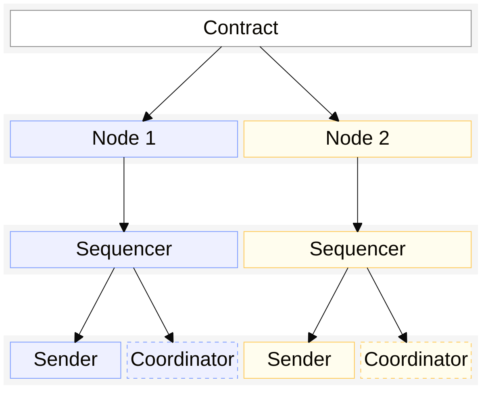
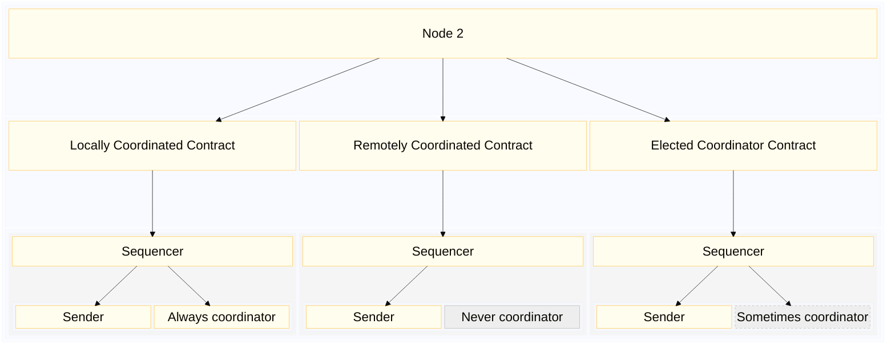
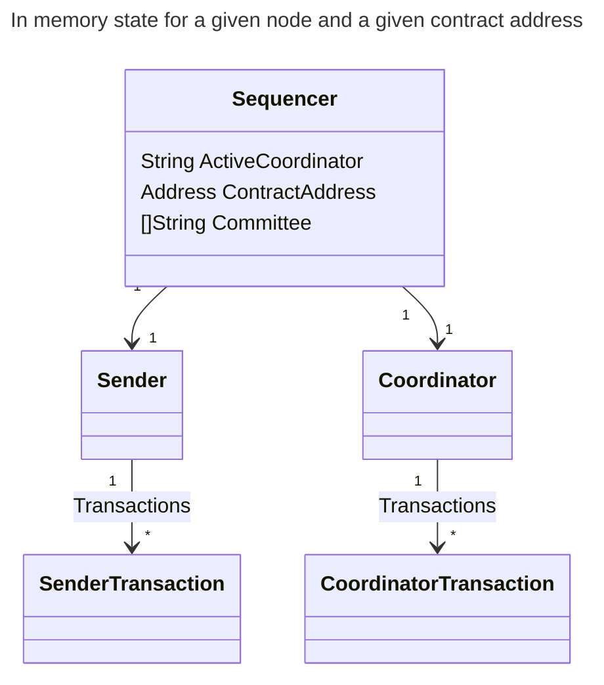
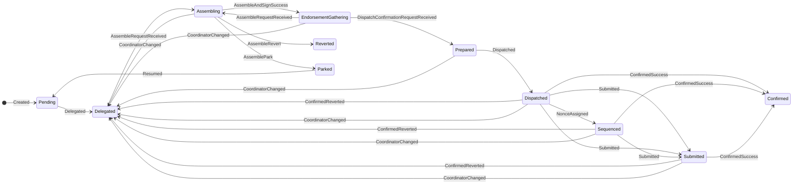
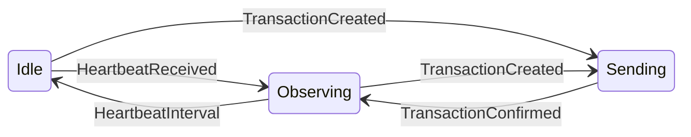
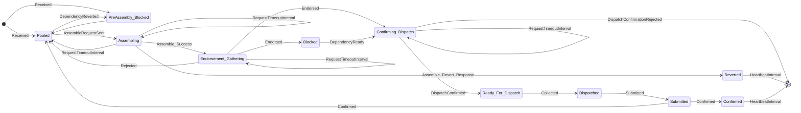
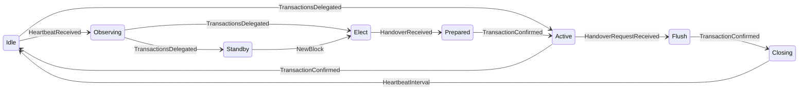

# Distributed sequencer

In domains (such as Pente) where the spending rules for states allow any one of a group of parties to spend the state, then we need to coordinate the assembly of transactions across multiple nodes so that we can maximize the throughput by speculatively spending new states and avoiding transactions being reverted due to double concurrent spending / state contention.

To achieve this, it is important that we have an algorithm that allows all nodes to agree on which of them should be selected as the coordinator at any given point in time. And all other nodes delegate their transactions to the coordinator.

A node uses 3 key components to coordinate transactions with a domain contract:

### 1 - Sequencer

The sequencer manages the lifecycle of transactions submitted to the node

### 2 - Sender

The sender is responsible for assembling and submitting transactions to the EVM when instructed to do so by the coordinator

### 3 - Coordinator

The coordinator determines which contract-wide states should be spent in order to satisfy a transaction's inputs and communicates with senders to instruct them what to submit to the EVM.

A coordinator may not always be running on every node participating in the private contract (see below).

## Introduction to transaction coordination

The coordination role varies depending on the type of domain. In some cases there are specific nodes in the network who coordinate all activity relating to a private transaction (for example Noto). In other cases the only node who can coordinate transactions is the originator of the transaction (for example Zeto).

Paladin domains use one of the following coordination models:

1. Always local
    - Always acts as coordinator for its own transactions relating to the contract, for example when participating in a Zeto token contract.
2. Always remote
    - Never acts as a coordinator for the private contract, for example when particpating in a Noto token but never acting as the notiary for the token
3. Leader elected
    - May act as a coordinator based on the distributed coordination algorithm, for example when participating in a Pente private contract

The following diagram shows 3 different domain contracts that 2 nodes are participating in. For the 3 domain contracts the nodes play different coordination roles:

```mermaid
%%{init: {'theme': 'base', 'themeVariables': { 'fontSize': '40px', 'fill':'#33bb22'}}}%%
block-beta
      columns 1
      block:domaintokens
        columns 3
        domainContract1["Locally Coordinated Contract"]
        domainContract2["Remotely Coordinated Contract"]
        domainContract3["Elected Coordinator Contract"]
        space
        space
        space
      end
      block:domaincontracts
        columns 3
        block:lcnodes
          columns 1
          block:lcnodelist
            columns 2
            c1node1["Node 1"]
            c1node2["Node 2"]
            space
            space
          end
          block:lcsequencercomponents
            columns 2
            c1node1sequencer["Sequencer"]
            c1node2sequencer["Sequencer"]
            space
            space
            block:seq1componentlist
              block:seq1components
                c1node1sender["Sender"]
                c1node1coordinator["Coordinator"]
              end
            end
            block:seq2componentlist
              block:seq2components
                c1node2sender["Sender"]
                c1node2coordinator["Coordinator"]
              end
            end
          end
        end
        block:rcnodes
          columns 1
          block:rcnodelist
            columns 2
            c2node1["Node 1"]
            c2node2["Node 2"]
            space
            space
          end
          block:rcsequencercomponents
            columns 2
            c2node1sequencer["Sequencer"]
            c2node2sequencer["Sequencer"]
            space
            space
            block:seq3componentlist
              block:seq3components
                c2node1coordinator["Coordinator"]
              end
            end
            block:seq4componentlist
              block:seq4components
                c2node2sender["Sender"]
              end
            end
          end
        end
        block:elnodes
          columns 1
          block:elnodelist
            columns 2
            c3node1["Node 1"]
            c3node2["Node 2"]
            space
            space
          end
          block:elsequencercomponents
            columns 2
            c3node1sequencer["Sequencer"]
            c3node2sequencer["Sequencer"]
            space
            space
            block:seq5componentlist
              block:seq5components
                c3node1sender["Sender"]
                c3node1coordinator["Coordinator"]
              end
            end
            block:seq6componentlist
              block:seq6components
                c3node2sender["Sender"]
                c3node2coordinator["Coordinator"]
              end
            end
          end
        end
  end
  domainContract1 --> c1node1
  domainContract1 --> c1node2
  domainContract2 --> c2node1
  domainContract2 --> c2node2
  domainContract3 --> c3node1
  domainContract3 --> c3node2
  c1node1 --> c1node1sequencer
  c1node2 --> c1node2sequencer
  c2node1 --> c2node1sequencer
  c2node2 --> c2node2sequencer
  c3node1 --> c3node1sequencer
  c3node2 --> c3node2sequencer
  c1node1sequencer --> c1node1sender
  c1node2sequencer --> c1node2sender
  c1node1sequencer --> c1node1coordinator
  c1node2sequencer --> c1node2coordinator
  c2node1sequencer --> c2node1coordinator
  c2node2sequencer --> c2node2sender
  c3node1sequencer --> c3node1sender
  c3node1sequencer --> c3node1coordinator
  c3node2sequencer --> c3node2sender
  c3node2sequencer --> c3node2coordinator
  style domainContract1 fill:#ffffff,stroke:#999999
  style domainContract2 fill:#ffffff,stroke:#999999
  style domainContract3 fill:#ffffff,stroke:#999999
  style c1node1 fill:#eef0ff,stroke:#7e9dff
  style c1node2 fill:#fffdee,stroke:#ffca58
  style c2node1 fill:#eef0ff,stroke:#7e9dff
  style c2node2 fill:#fffdee,stroke:#ffca58
  style c3node1 fill:#eef0ff,stroke:#7e9dff
  style c3node2 fill:#fffdee,stroke:#ffca58
  style c1node1sequencer fill:#eef0ff,stroke:#7e9dff
  style c1node2sequencer fill:#fffdee,stroke:#ffca58
  style c2node1sequencer fill:#eef0ff,stroke:#7e9dff
  style c2node2sequencer fill:#fffdee,stroke:#ffca58
  style c3node1sequencer fill:#eef0ff,stroke:#7e9dff
  style c3node2sequencer fill:#fffdee,stroke:#ffca58
  style c1node1coordinator fill:#e8eeff,stroke:#a7bcff
  style c1node2coordinator fill:#fffdee,stroke:#ffca58
  style c2node1coordinator fill:#e8eeff,stroke:#a7bcff
  style c3node1coordinator fill:#e8eeff,stroke:#a7bcff
  style c3node2coordinator fill:#ffffff,stroke:#777777,stroke-dasharray: 5 5
  style c1node1sender fill:#e8eeff,stroke:#a7bcff
  style c1node2sender fill:#fffdee,stroke:#ffca58
  style c2node2sender fill:#fffdee,stroke:#ffca58
  style c3node1sender fill:#e8eeff,stroke:#a7bcff
  style c3node2sender fill:#fffdee,stroke:#ffca58
  style seq1components fill:#f5f5f5,stroke:#f5f5f5
  style seq2components fill:#f5f5f5,stroke:#f5f5f5
  style seq3components fill:#f5f5f5,stroke:#f5f5f5
  style seq4components fill:#f5f5f5,stroke:#f5f5f5
  style seq5components fill:#f5f5f5,stroke:#f5f5f5
  style seq6components fill:#f5f5f5,stroke:#f5f5f5
  style seq1componentlist fill:#f5f5f5,stroke:#f5f5f5
  style seq2componentlist fill:#f5f5f5,stroke:#f5f5f5
  style seq3componentlist fill:#f5f5f5,stroke:#f5f5f5
  style seq4componentlist fill:#f5f5f5,stroke:#f5f5f5
  style seq5componentlist fill:#f5f5f5,stroke:#f5f5f5
  style seq6componentlist fill:#f5f5f5,stroke:#f5f5f5
  style lcnodes fill:#f5f5f5,stroke:#f5f5f5
  style lcnodelist fill:#f5f5f5,stroke:#f5f5f5
  style lcsequencercomponents fill:#f5f5f5,stroke:#f5f5f5
  style elnodes fill:#f5f5f5,stroke:#f5f5f5
  style elnodelist fill:#f5f5f5,stroke:#f5f5f5
  style elsequencercomponents fill:#f5f5f5,stroke:#f5f5f5
  style rcnodes fill:#f5f5f5,stroke:#f5f5f5
  style rcnodelist fill:#f5f5f5,stroke:#f5f5f5
  style rcsequencercomponents fill:#f5f5f5,stroke:#f5f5f5
  style domaintokens fill:#f5f5f5,stroke:#f5f5f5
  style domaincontracts fill:#f5f5f5,stroke:#f5f5f5
```

In the example above the coordination is as follows:

- The locally coordinated contract requires every node to coordinate their own private transactions.
- The remotely coordinated contract is always coordinated by Node 1. Node 2 never acts as the coordinator.
    - In this example Node 1 isn't participating in the private contract itself, it is only acting as the coordinator. This is a common pattern for notarized contracts where coordination is performed by a separate group of nodes.
- The elected coordinator contract is coordinated by the currently elected leader. At any given time, either node may be the coordinator depending on the leadership election algorithm

Since a Paladin node may be participating in multiple private contracts in different Paladin domains, it may be running coordinators for some contracts but not running coordinators for others. If the node never acts as a coordinator for one of the private contracts its sequencer only serves to submit transactions based on instructions from the coordinator (running on another node).

The following diagram shows the components that are active in a node for 3 types of domain contract:

## Scope of the distributed sequencing algorithm

The distributed coordination algorithm described in the rest of this topic only applies to *Remotely Coordinated* and *Leader Elected* domains.

*Locally Coordinated* domains always run a coordinator for every participating node. Nodes cannot coordinate other nodes' transactions, even if they are participating in the same private contract.

*Remotely Coordinated* domains could be considered a sub-category of *Leader Elected*. In some cases there will be a single coordinator for all participating nodes. However, in other cases there may be a group of remote coordinators who could use leadership election to determine which coordinator is currently the active one. For this topic the distributed sequencing algorithm applies to *Remotely Coordinated* domains where there is more than 1 possible coordinator for the contract.

## Objectives

The objective of this algorithm is to maximize efficiency (reduce probably for revert leading to retry cycles of valid request) and throughput (allow many transactions to be included in each block). This algorithm does not attempt to provide a guarantee on final data consistency but instead relies on the base ledger contract to do so (e.g. double spend protection, attestation validation, exactly once intent fulfillment).

The desired properties of that algorithm are

- **deterministic**: all nodes can run the algorithm and eventually agree on a single coordinator at any given point in time. This is a significant property because it means we don't want to rely on a message-based leader election process like in some algorithms such as Raft. This reduces the overhead of message exchanges among the nodes
- **fair**: the algorithm results in each node being selected as coordinator for a proportional number of times over a long enough time frame
- **fault tolerant**: Although pente already depends on all nodes being available (because of the 100% endorsement model) the desired algorithm should be future proof and be compatible with <100% endorsement model where network faults and down time of a minority of nodes can bee tolerated.

## Summary

The 3 basic premises of the algorithm are:

  1. Once a coordinator has been elected, it is possible for it to continue indefinitely as the coordinator
    - This is an intentional design choice, intended to provide optimal throughput for a contract
  2. If an elected coordinator fails, another coordinator will take over the role
    - This ensures high availability of the private contract
  3. The choice of coordinator is deterministic based on block number and liveness of the existing coordinator
    - The deterministic choice  of coordinator only needs to take place if the existing coordinator becomes unavailable

Full rules for the the algorithm:

 - Ranking of the preference for coordinator selection for any given contract address, for any given point in time ( block height) is a deterministic function that all nodes will agree on given the same awareness of make up of committee 
 - Composition of committee i.e. the set of nodes who are candidates for coordinator is universally agreed (similar to BFT algorithms).
 - Liveness of the coordinator node can be detected via heartbeat messages.
  - Coordinators will keep going until they are told otherwise (e.g. by a handover request from another coordinator) or there is a sufficient lul in activity that it naturally flushes 
     - if that means the coordinator goes on forever, then so be it
     - senders keep delegating to the current active coordinator and only chose a new one if that coordinator stops sending heartbeats.
     - senders remember which coordinators have been detected as unresponsive recently and go through the list in order  
     - this means that if sender A fails over (or swaps out / in) while sender B is still online, then sender A may delegate to a different coordinator and trigger a handover.  So be it.  
 - The sender node for each transaction is responsible for ensuring that the transaction always has one coordinator actively coordinating it by detecting and responding to situations where the transaction is not being coordinated
 - Situations can arise where different nodes chose different coordinators because of different awareness of block height and/or different awareness of availability.  The algorithm is less efficient when this happens but continues to function and can return to full efficiency as soon as the situation is resolved.
 - There is no need for election `term`s in this algorithm.
 - When coordinator responsibility is switched to another node, each inflight transaction is either re-assigned to the new coordinator or flushed through to confirmation on the base ledger
 - If the sender deems the transaction to be no longer valid, it is responsible for finalizing it as reverted.
 - If the sender deems the transaction not ready to be submitted, it is responsible for parking it until it is ready.
 - If a transaction is successfully assembled and endorsed but subsequently reverted on the base ledger contract, the coordinator is is responsible for retrying at a frequency that does not cause excessive load on the system.
 - The sender node continues to monitor and control the delegation of its transaction until it has received receipt of the transactions' confirmations on the base ledger. This provides an "at least once" quality of service for every transaction at the distributed sequencer layer. As described earlier the blockchain enforces "at most once" semantics, so there is no possibility of duplicate transactions.
 - The handshake between the sender node and the coordinator node(s) attempts to minimize the likelihood of the same transaction intent resulting in 2 valid base ledger transactions but cannot eliminate that possibility completely so there is protection against duplicate intent fulfillment in the base ledger contract
  
## Components of a sequencer

For each node, for each active private contract, there is one instance of the `Sequencer` in memory. The `Sequencer` contains sub components for `Sender` and `Coordinator`. `Sender` is responsible for tracking the lifecycle of transactions sent to this node and the `Coordinator` is responsible for coordinating the assembly and submission of transactions from all `Senders`.

## Transaction lifecycle

#### Senders transaction state

The states that a transaction goes through, from the perspective of the transaction sender are:

 - Initial:  Initial state before anything is calculated
 - Pending:              Intent for the transaction has been created in the database and has been assigned a unique ID but is not currently known to be being processed by a coordinator
 - Delegated:            the transaction has been sent to the current active coordinator
 - Assembling:           the coordinator has sent an assemble request that we have not replied to yet
 - EndorsementGathering: e have responded to an assemble request and are waiting the coordinator to gather endorsements and send us a dispatch confirmation request
 - Signing:              we have assembled the transaction and are waiting for the signing module to sign it before we respond to the coordinator with the signed assembled transaction
 - Prepared:             we know that the coordinator has got as far as preparing a public transaction and we have sent a positive response to a coordinator's dispatch confirmation request but have not yet received a heartbeat that notifies us that the coordinator has dispatched the transaction to a public transaction manager for submission
 - Dispatched:           the active coordinator that this transaction was delegated to has dispatched the transaction to a public transaction manager for submission
 - Sequenced:            the transaction has been assigned a nonce by the public transaction manager
 - Submitted:            the transaction has been submitted to the blockchain
 - Confirmed:            the public transaction has been confirmed by the blockchain as successful
 - Reverted:             upon attempting to assemble the transaction, the domain code has determined that the intent is not valid and the transaction is finalized as reverted
 - Parked:               upon attempting to assemble the transaction, the domain code has determined that the transaction is not ready to be assembled and it is parked for later processing.  All remaining transactions for the current sender can continue - unless they have an explicit dependency on this transaction

Events that can cause a transition between states and/or trigger an action when the transaction is in a given state are:

 - Created: Transaction initially received by the sender or has been loaded from the database after a restart / swap-in
 - ConfirmedSuccess: Confirmation received from the blockchain of base ledge transaction successful completion
 - ConfirmedReverted: Confirmation received from the blockchain of base ledge transaction failure
 - Delegated: Transaction has been delegated to a coordinator
 - AssembleRequestReceived: Coordinator has requested that we assemble the transaction
 - AssembleAndSignSuccess: We have successfully assembled the transaction and signing module has signed the assembled transaction
 - AssembleRevert: We have failed to assemble the transaction
 - AssemblePark: We have parked the transaction
 - AssembleError: An unexpected error occurred while trying to assemble the transaction
 - Dispatched: Coordinator has dispatched the transaction to a public transaction manager
 - DispatchConfirmationRequestReceived: Coordinator has requested confirmation that the transaction has been dispatched
 - Resumed: Received an RPC call to resume a parked transaction
 - NonceAssigned: The public transaction manager has assigned a nonce to the transaction
 - Submitted: The transaction has been submitted to the blockchain
 - CoordinatorChanged: The coordinator has changed

#### Senders state

The states that a sender goes through:

- Idle: Not acting as a sender and not aware of any active coordinators
- Observing: Not acting as a sender but aware of a node (which may be the same node) acting as a coordinator
- Sending: Has some transactions that have been sent to a coordinator but not yet confirmed TODO should this be named State_Monitoring or State_Delegated or even State_Sent. Sending sounds like it is in the process of sending the request message.

Events that can cause a transition between states and/or trigger an action when the sender is in a given state are:

- HeartbeatInterval: The heartbeat interval has passed since the last time a heartbeat was received or the last time this event was received
- HeartbeatReceived: A heartbeat message was received from the current active coordinator
- TransactionCreated: A new transaction has been created and is ready to be sent to the coordinator
- TransactionConfirmed: A transaction, that was send by this sender, has been confirmed on the base ledger
- NewBlock: A new block has been mined on the base ledger
- Base_Ledger_Transaction_Reverted: a transaction has moved from the dispatched to pending state because it was reverted on the base ledger

#### Coordinators transaction state

The states that a transaction goes through, from the perspective of the transaction coordinator are:

- Pooled: Waiting in the pool to be assembled - TODO should rename to "Selectable" or "Selectable_Pooled". Related to potential rename of `State_PreAssembly_Blocked`
- PreAssembly_Blocked: Has not been assembled yet and cannot be assembled because a dependency never got assembled successfully - i.e. it was either Parked or Reverted is also blocked
- Assembling: An assemble request has been sent but we are waiting for the response
- Reverted: The transaction has been reverted by the assembler/sender
- Endorsement_Gathering: Assembled and waiting for endorsement
- Blocked: Is fully endorsed but cannot proceed due to dependencies not being ready for dispatch
- Confirming_Dispatch: Endorsed and waiting for dispatch confirmation
- Ready_For_Dispatch: Dispatch confirmation received and waiting to be collected by the dispatcher thread.Going into this state is the point of no return
- Dispatched: Collected by the dispatcher thread but not yet
- Submitted: At least one submission has been made to the blockchain
- Confirmed: Recently confirmed on the base ledger. NOTE: confirmed transactions are not held in memory for ever so getting a list of confirmed transactions will only return those confirmed recently
- Final: Final state for the transaction. Transactions are removed from memory as soon as they enter this state

Events that can cause a transition between states and/or trigger an action when the transaction is in a given state are:

- Received: Transaction initially received by the coordinator. Might seem redundant explicitly modeling this as an event rather than putting this logic into the constructor, but it is useful to make the initial state transition rules explicit in the state machine definitions
- Selected: Selected from the pool as the next transaction to be assembled
- AssembleRequestSent: Assemble request sent to the assembler
- Assemble_Success: Assemble response received from the sender
- Assemble_Revert_Response: Assemble response received from the sender with a revert reason
- Endorsed: Endorsement received from one endorser
- EndorsedRejected: Endorsement received from one endorser with a revert reason
- DependencyReady: Another transaction, for which this transaction has a dependency on, has become ready for dispatch
- DependencyAssembled: Another transaction, for which this transaction has a dependency on, has been assembled
- DependencyReverted: Another transaction, for which this transaction has a dependency on, has been reverted
- DispatchConfirmed: Dispatch confirmation received from the sender
- DispatchConfirmationRejected: Dispatch confirmation response received from the sender with a rejection
- Collected: Collected by the dispatcher thread
- NonceAllocated: Nonce allocated by the dispatcher thread
- Submitted: Submission made to the blockchain. Each time this event is received, the submission hash is updated
- Confirmed: Confirmation received from the blockchain of either a successful or reverted transaction
- RequestTimeoutInterval: Event emitted by the state machine on a regular period while we have pending requests
- StateTransition: Event emitted by the state machine when a state transition occurs. TODO should this be a separate enum?
- AssembleTimeout: The assemble timeout period has passed since we sent the first assemble request

#### Coordinators state

The states that a coordinator goes through:

- Idle: Not acting as a coordinator and not aware of any other active coordinators
- Observing: Not acting as a coordinator but aware of another node acting as a coordinator
- Elect: Elected to take over from another coordinator and waiting for handover information
- Standby: Going to be coordinator on the next block range but local indexer is not at that block yet.
- Prepared: Have received the handover response but haven't seen the flush point confirmed
- Active: Have seen the flush point or have reason to believe the old coordinator has become unavailable and am now assembling transactions based on available knowledge of the state of the base ledger and submitting transactions to the base ledger.
- Flush: Stopped assembling and dispatching transactions but continue to submit transactions that are already dispatched
- Closing: Have flushed and am continuing to sent closing status for `x` heartbeats

Events that can cause a transition between states and/or trigger an action when the coordinator is in a given state are:

- TransactionsDelegated
- TransactionConfirmed
- TransactionDispatchConfirmed
- HeartbeatReceived
- NewBlock
- HandoverRequestReceived
- HandoverReceived
- TransactionStateTransition

