# Distributed Sequencer

In domains (such as Pente) where the spending rules for states allow any one of a group of parties to spend the state, then we need to coordinate the assembly of transactions across multiple nodes so that we can maximize the throughput by speculative spending new states and avoid transactions being reverted due to double concurrent spending / state contention.

To achieve this, it is important that we have an algorithm that allows all nodes to agree on which of them should be selected as the coordinator at any given point in time. And all other nodes delegate their transactions to the coordinator.

## Objectives 

The objective of this algorithm is to maximize efficiency ( reduce probably for revert leading to retry cycles of valid request) and throughput ( allow many transactions to be included in each block).  This algorithm does not attempt to provide a guarantee on final data consistency but instead relies on the base ledger contract to do so (e.g. double spend protection, attestation validation).

 The desired properties of that algorithm are

 - **deterministic**: all nodes can run the algorithm and eventually agree on a single coordinator at any given point in time. This is a significant property because it means we don't want to rely on a message-based leader election process like in some algorithms such as Raft. This reduces the overhead of message exchanges among the nodes
 - **fair**: the algorithm results in each node being selected as coordinator for a proportional number of times over a long enough time frame
 - **fault tolerant**:  Although pente already depends on all nodes being available (because of the 100% endorsement model) the desired algorithm should be future proof and be compatible with <100% endorsement model where network faults and down time of a minority of nodes can bee tolerated.

## Summary
The basic premises of the algorithm are:

 - composition of committee i.e. the set of nodes who are candidates for coordinator is universally agreed (similar to BFT algorithms).
 - liveness of the coordinator node can be detected via heartbeat messages (similar to RAFT).
 - ranking of the preference for coordinator selection for any given contract address, for any given point in time ( block height) is a deterministic function that all nodes will agree on given the same awareness of make up of committee
 - choice of coordinator can change over time either due increase in block height triggering a rotation of the responsibility or the current coordinator being detected as unavailable. 
 - situations can arise where different nodes chose different coordinators because of different awareness of block height and/or different awareness of availability.  The algorithm is less efficient when this happens but continues to function and can return to full efficiency as soon as the situation is resolved.
 - there is no need for election `term`s in this algorithm.
 - when coordinator responsibility is switched to another node, each inflight transaction is either re-assigned to the new coordinator or flushed through to confirmation on the base ledger
 - the sender node for each transaction is responsible for ensuring that the transaction always has one coordinator actively coordinating it by detecting and responding to situations where the current coordinator becomes available, a more preferred coordinator comes back online or preference changes due to new block height.  (unless the sender deems the transaction to be no longer valid in which case, it marks it as reverted).
 - The sender node continues to monitor and control the delegation of its transaction until it has received receipt of the transactions' confirmations on the base ledger. This provides an "at least once" quality of service for every transaction.
 - The handshake between the sender node and the coordinator node(s) attempts to minimize the likelihood of the same transaction intent resulting in 2 valid base ledger transactions but cannot eliminate that possibility completely so there is protection against duplicate intent fulfillment in the base ledger contract
   -  TBD: this is a big decision and has not yet been fully discussed and agreed.  See the  _Decision points and alternatives considered_ section for more detail

## Detail
To describe the algorithm in detail, we break it down to sub problems

### Composition of committee
When creating a new Pente domain contract instance ( i.e. privacy group) the list of nodes that are candidates for coordinator selection is declared.  For Pente this happens to be exactly equal to the privacy group but potentially could theoretically be a subset of the privacy group.

Similarly, any other future domain that opts in to the dynamic coordinator selection policy,  must provide this information as part of the constructor handshake between the domain and the core paladin engine.

### Coordinator selection

This is a form of leader election but is achieved through deterministic calculation for a given point in time ( block height), given predefined members of the group, and a common (majority) awareness of the current availability of each member. So there is no actual "election" term needed.

Each node is allocated positions on a hash ring.  These positions are a function of the node name.  Given that the entire committee agrees on the names of all nodes, all nodes independently arrive at the same decision about the positions of all nodes.

For the current block height, a position on the ring is calculated from a deterministic function.  The node that is closest to that position on the ring is selected as the coordinator.  If that node is not available, then the next closest node is selected. If that node is not available, then the next closest again is selected, and so on.

For each Pente domain instance ( smart contract API) the coordinator is selected by choosing one of the nodes in the configured privacy group of that contract

 - the selector is a pure function where the inputs are the node names + the current block number and the output is the name of one of the nodes
 - the function will return the same output for a range of `n` consecutive blocks ( where `n` is a configuration parameter of the policy)
 - for the next range of `n` blocks, the function will return a different ( or possibly the same) output
 - over a large sample of ranges, the function will have an even distribution of outputs
 - the function will be implemented by taking a hash of each node name, taking the hash of the output of `b/n` (where b is the block number and `n` is the range size) rounded down to the nearest integer and feeding those into a hashring function.

{ width="500" }

In the example here, lets say we chose a hash function with a numeric output between 0 and 360 where the hash of node A's name happens to be 315, node B is 45, node C is 225 and node D is 135.  Lets say we have a range size of 4, therefore for block numbers 0-3, we can calculate that they belong to range number 0, blocks 4-7 belong to range number 1 and so on.  Lets say that the hash function, when applied to `range0` returns 310.  When applied to `range1` returns 55 and when applied to `range2` returns 120.  Interpreting all of those hash output as degrees and plotting them on the circle ( with 0° at the top). We can then deterministically calculate that nodeA is selected while the block height is between 0 and 3, node B is selected when the block height is between 4 and 7 and node D is selected while the block height is between 8 an 11

### Node availability detection

When a node calculates itself as the coordinator, then it  periodically sends a heartbeat message to the other nodes and  will accept delegation requests from any other node in the group. 

All nodes keep track of the current selected coordinator ( either by reevaluating the deterministic function periodically or caching the result until block height exceeds the current range boundary).  If they fail to receive a heartbeat message from the current coordinator, then they will chose the next closest node in the hashring (e.g. by reevaluating the hashring function with the unavailable nodes removed).

For illustration, consider the following example where nodes B, C, and D have recognized node A as the coordinator and have delegated transactions (labelled `B-1`, `C-1` and `D-1` )to it.

{ width="500" }

Node A then proceeds to broadcast heartbeat messages

{ width="500" }

Suddenly, Node A stops sending heartbeat messages, either because it has crashed or it has lost network connectivity to other nodes

{ width="500" }

When nodes B and D realize that the heartbeats have stopped, then they consider node A as unavailable and each independently select node C as the next closest node on the ring and delegate their inflight transactions to it.  Similarly, nodeC selects itself as the coordinator and continues to coordinate its own transaction `C-1` along with the delegated transactions from node B and node D.

{ width="500" }

Node C then proceeds to act as coordinator and sends periodic heartbeat messages to the other nodes. 

{ width="500" }

If Node A comes back online, then it will begin transmitting heartbeat messages again because it has selected itself as coordinator given the current block height.

{ width="500" }

As soon as nodes B. C and D receive the heartbeat messages from node A they each independently concur that node A is the preferred choice for coordinator and delegate any inflight transactions to it.  Node C decides to cease acting as coordinator and abandons any transactions that it has in flight.

{ width="500" }

 This universal conclusion is reached without any communication necessary between nodes B, C and D and without any knowledge of recent history.  Therefore is tolerant to any failover of nodes B, C or D in the interim and has a deterministic conclusion, that can be predicted by node A regardless of what other activity happened to occur while node A was offline (e.g. if node C had gone offline and coordinator role switched to B, or switch back to C ) 

### Network partition
The sender node ultimately bears the responsibility of selecting a coordinator for their transactions. If a single coordinator is universally chosen, the algorithm operates accordingly with maximum efficiency and data integrity (transactions are successfully confirmed on base ledger and no state is double spent). 

If multiple nodes select different coordinators, the system’s efficiency suffers significantly but the eventual "correctness" of the on chain state is not adversely affected. The algorithm is designed to minimize the likelihood of this occurrence. However, the probability of this eventuality is never zero. For instance, in the case of network partitions, this exact situation can emerge.  In this case the base ledger contract provides protection against double spending and all transactions may even eventually be processed (depending on how the endorsement policy is affected) albeit at a much reduced efficiency given the likely hood for failure and retry.

Given the behavior of the current version of Pente domain, when there is a network partition situation then neither coordinator will be able to achieve endorsement due to the 100% endorsement policy.  However, as a more general design and analysis, we consider the hypothetical future case of <100% endorsement.  For certain endorsement policies, each coordinator could theoretically get to the point of submitting transactions to the base ledger.   Each coordinator is operating with a different domain context ( a different awareness of which states have been spent / are earmarked to be spent)  therefore transactions from different coordinators would attempt to spend the same state.  Depending on the relative order that those transactions are added to a block, then transactions from one side or the other of the partition will be reverted and will need to be reassembled.

Whether the coordinators were able to limp along or had came to a halt, or some combination, in either case, once the network connectivity has been restored, the system returns to an efficient operational state.

In the following illustration, a network partition occurs which resulting in nodes A and B continuing to communicate with each other but not with nodes C or D meanwhile nodes C and D can continue to communicate with each other.

{ width="500" }

Once the network connectivity has been restored, the heartbeat messages from both coordinators are received by all other nodes.

{ width="500" }

At this point, node B and node C independently conclude that node A is the preferred coordinator and accordingly, they delegate their transactions to node A.  Node C ceases to act as coordinator and abandons any transactions that it has in flight.

{ width="500" }

The system reaches the desired eventual state of node A being coordinator, sending heartbeat messages to all nodes

{ width="500" }

TODO

 - might be useful to illustrate the "limp mode" in more detail where both coordinators are managing to get transactions through but the base ledger contract is providing double spend protection and the retry strategy of the coordinator means that transactions are eventually processed correctly 
 - all of the above seems to assume that the network partition affects communication between paladin nodes but not the blockchain.  Should really discuss and elaborate what happens when the block chain nodes are not able to communicate with each other ( esp. in case of public chains where long finality times are possible).  The TL;DR is - notwithstanding this algorithm, the paladin core engine and its management of domain contexts must be mindful of the difference between block receipts and finality and should have mechanisms to configure the number of confirmed blocks it considers as final and/or to reset domain contexts and redo transaction intents that ended up on blocks that got reversed.
 
### Coordinator switchover
When the block height reaches a range boundary then all nodes independently reach a universal conclusion the new coordinator.

Lets consider the case where the scenario explored above continues to the point where the blockchain moves to block 4.  In the interim, while node A was coordinator, nodes B, C and D delegated transactions `B-1`, `B-2`, `B-3`,  `C-1`, `C-2`, `C-3`, `D-1`, `D-2` and `D-3`,  and A itself has assembled `A-1`, `A-2`, `A-3`.

`A-1` , `B-1`, `C-1` and `D-1` have already been submitted to base ledger and confirmed.  
`A-2` , `B-2`, `C-2` and `D-2` have been prepared for submission, assigned a signing address and a nonce but have not yet been mined into a confirmed block.  NOTE it is irrelevant whether these transactions have been the subject of an `eth_sendTransaction` yet or not.  i.e. whether they only exist in the memory of the paladin node's transaction manager or whether they exist in the mempool of node A's blockchain node.  What is important is that

 - they have been persisted to node A's database as being "dispatched" and
 - are not included in block 3 or earlier

{ width="500" }

As all nodes in the group ( including node A) receive receipts of block 3, they will recognize node B as the new coordinator

{ width="500" }

Node A will continue to process and monitor receipts for transactions `A-2` , `B-2`, `C-2` and `D-2` but will abandon transactions `A-3` , `B-3`, `C-3` and `D-3`.

{ width="500" }

Node A sends a `DelegationReturned` message to the respective sender nodes for each non dispatched transaction that it had in flight.

{ width="500" }

The final transmission from node A, as coordinator, is a message to node B with details of the speculative domain context predicting confirmation of transactions `A-2` , `B-2`, `C-2` and `D-2` .  This includes the state IDs for any new states created by those transactions and any states that are spent by those transaction.  This message also includes the transaction hash for the final transaction that is submitted on the sequence coordinated by node A.  Node B needs to receive this message so that it can proceed with maximum efficiency. Therefore this message is sent with an assured delivery quality of service (similar to state distribution).  

Meanwhile, all nodes delegate transactions  `A-3` , `B-3`, `C-3` and `D-3` to node B.  

{ width="500" }

Node B will start to coordinate the assembly and endorsement of these transactions but hold off from preparing them for dispatch to its transaction manager yet.

{ width="500" }

Once  transactions `A-2` , `B-2`, `C-2` and `D-2` have been confirmed in a block ( which may be block 4 or may take more than one block) and node B has received confirmation of this, then node B will continue to prepare and submit transactions `A-3` , `B-3`, `C-3` and `D-3`.

{ width="500" }

Eventually transactions `A-3` , `B-3`, `C-3` and `D-3` are mined to a block.

{ width="500" }

Note that there is a brief dip in throughput as node B waits for node A to flush through the pending dispatched transactions and there is also some additional processing for the inflight transactions that haven't been dispatched yet.  So a range size of 4 is unreasonable and it would be more likely for range sizes to be much larger so that these dips in throughput become negligible.

TODO

 - need more detail on precisely _how_  nodes B, C and D know that transactions `B-2``A-2` , `B-2`, `C-2` and `D-2` are past the point of no return and that transactions `A-3` , `B-3`, `C-3` and `D-3` do need to be re-delegated.
 - need more detail on precisely _how_ node B can continue to coordinate the assembly of transactions `A-3` , `B-3`, `C-3` and `D-3` in a domain context that is aware of the speculative states locks from transactions `B-2``A-2` , `B-2`, `C-2` and `D-2` 
 - It might be more productive for the next level of detail on these points to come in the form of a proposal in code.

### Variation in block height
It is likely that different nodes will become aware of new block heights at different times so the algorithm must accommodate that inconsistency. 

 - given that different nodes index the blockchain events with varying latency, it is not assumed that all nodes have the same awareness of "current block number" at any one time. This is accommodated by the following
 - Each node delegates all transactions to which ever node it determines as the current coordinator based on its latest knowledge of "current block"
 - The delegate node will accept the delegation if its awareness of current block also results in it being chosen by the selector function.  Otherwise, the delegate node rejects the delegation and includes its view of current block number in the response
 - On receiving the delegation rejection, the sender node can determine if it is ahead or behind (in terms of block indexing) the node it had chosen as delegate.  
 - If the sender node is ahead, it continues to retry the delegation until the delegate node finally catches up and accepts the delegation
 - If the sender node is behind, it waits until its block indexer catches up and then selects the coordinator for the new range
 - Coordinator node will continue to coordinate ( send endorsement requests and submit endorsed transactions to base ledger) until its block indexer has reached a block number that causes the coordinator selector to select a different node.
 - at that time, it waits until all dispatched transactions are confirmed on chain, then delegates all current inflight transactions to the new coordinator.
 - if the new coordinator is not up to date with block indexing, then it will reject and the delegation will be retried until it catches up. 
 - while a node is the current selected coordinator, it sends endorsement requests to every other node for every transaction that it is coordinating
 -  The endorsement request includes the name of the coordinator node
 - Each endorsing node runs the selector function to determine if it believes that is the correct coordinator for the current block number
 - if not, then it rejects the endorsement and includes its view of the current block number in the rejection message
 - when the coordinator receives the rejection message, it can determine if it is ahead or behind the requested endorser
 - if the coordinator is ahead, it retries the endorsement request until the endorser catches up and eventually endorses the transaction
 - if the coordinator is behind, then it waits until its block indexer reaches the next range boundary and delegates all inflight transactions to the new coordinator

### Sender's responsibility

The sender node for any given transaction remains ultimately responsible for ensuring that transaction is successfully confirmed on chain or finalized as failed if it is not possible to complete the processing for any reason.  While the coordination of assembly and endorsement is delegated to another node, the sender continues to monitor the progress and is responsible for initiating retries or re-delegation to other coordinator nodes as appropriate.

Feedback available to the sender node that can be monitored to track the progress or otherwise of the transaction submission:

 - when the sender node is choosing the coordinator, it may have recently received a heartbeat message from the preferred coordinator or an alternative coordinator
 - when sending the delegation request to the coordinator, the sender node expects to receive an acknowledgement that the request has been received.  This is not a guarantee that the transaction will be completed.  At this point, the coordinator has only an in-memory record of that delegated transaction
 - coordinator heartbeat messages.  The payload of these messages contains a list of transaction IDs that the coordinator is actively coordinating
 - transaction confirmation request.  Once the coordinator has fulfilled the attestation plan, it sends a message to the transaction sender requesting permission to dispatch. If, for any reason, the sender has already re-delegated to another coordinator, then it will reject this request otherwise, it will accept.
 - transaction dispatched message.  When the coordinator prepares a transaction for submission to base ledger, it sends a message to the sender node for that transaction to communicate that fact.  The delivery of the message happens after the coordinator has written to its local database. The same database transaction triggers the downstream process to submit the transaction to the blockchain node.  The submission process happens concurrently to the transaction dispatched message.  So when the `sender` node receives the `transaction dispatched message`, there is no guarantee whether the transaction has been submitted to base ledger yet or not.  However, there is an assurance that the coordinator node has persistent the intent to submit it and will endeavor to do so even if it fails over.  However there are error situations where this is not possible (e.g. it could lose access to the signing key, or lose connectivity to the blockchain node) and these situations may be transient or may be permanent. 
 - blockchain event.  The base ledger contract for each domain emits a custom event that included the transaction ID.  The sender node will detect when such an event corresponds to one of its transactions and will record that transaction as confirmed.
 - transaction reverted message.  When the submitter fails to submit the transaction, for any reason, and gives up trying , then a `TransactionReverted` message is sent to the sender of that transaction.  There are some cases where the submitter retries certain failures and does *not* send this message.

Decisions and actions that need to be taken by the sender node

 - When a user sends a transaction intent (`ptx_sendTransaction` or `ptx_prepareTransaction`), the sender node needs to chose which coordinator to delegate to.
 - If the block height changes and there is a new preferred coordinator as per the selection algorithm then the sender node needs to decide whether to delegate the transaction to it. This will be dependent on whether the transaction has been dispatched or not.
 - If the coordinator node seems to have forgotten about the transaction, then the sender node needs to decide to re-delegate it
 - If the preferred coordinator node becomes unavailable then the sender node needs to decide which alternative coordinator to delegate to
 - If a transaction has been delegated to an alternative coordinator and the preferred coordinator becomes available again, then the sender needs to decide to re-delegate to the preferred coordinator
 - Given that there could have been a number of attempts to delegate and re-delegate the transaction to different coordinators, when any coordinator reaches the point of dispatching the transaction, the sender needs to decide whether or not it is valid to dispatch at the time, by that coordinator
 - If the base ledger transaction is reverted for any reason, then the sender decides to retry

To illustrate, lets consider the following scenarios

 - simple happy path: sender delegates transaction to a coordinator and that coordinator eventually successfully submits it to the base ledger contract
 - happy path with switchover: sender delegates transaction to a coordinator but before the transaction is ready for submission, the block height changes, a new coordinator is selected which then  eventually successfully submits it to the base ledger contract
 - realistic happy path: given that different nodes are likely to become aware of block height changes at different times, there are 6 different permutations of the order in which the 3 nodes ( sender, previous coordinator, new coordinator) become aware of the new block height but to understand the algorithm, we can reduce the analysis to 3 more general cases: When the sender is behind, when the previous coordinator is behind and when the new coordinator is behind.
 - failover cases: there is no persistence checkpoints between the transaction intent being received by the sender node and the transaction being dispatched to the base ledger submitter so if either the sender or coordinator node process restarts, then it loses all context of that delegation
     - sender failover.  If the sender restarts, it reads all pending transactions from its database and delegates each transaction to the chosen coordinator for that point in time. This may be the same coordinator that it delegates to previously or may be a new one. The sender holds, in memory, the name of the current coordinator and will only accept a dispatch confirmation from that coordinator.  So if it happens to be the case that it had delegated to a different coordinator before it restarted, then it will reject the dispatch confirmation from that coordinator and that copy of the assembled transaction will be discarded. Noting that this would trigger a re-assembly and re-run of the endorsement flow for any other transactions, including those from other senders, that have been assembled to spend the states produced by the discarded transaction. However, in most likeliness, all other senders will switch their preference to the same new coordinator and trigger a re-do of all non dispatched transactions.
     - coordinator failover. When the coordinator restarts, it will continue to send heartbeat messages but those messages only contain the transaction ids for the transactions that were delegated to it since restart.  For any pending transactions that were previously delegated to it, when the sender of those transactions receives the heartbeat message and realizes the that coordinator has "forgotten" about the transaction, then the sender re-delegates those transactions.
 - coordinator becomes unavailable:  If the sender stops receiving heartbeat messages from the coordinator, then it assumes that the coordinator has become unavailable.  However it may actually be the case that the coordinator is still running and just that the network between the coordinator and the sender has a fault.  The action of the sender for each inflight transaction depends on exactly which stage of the flow the sender believes that transaction to be.  The consequence of the sender's action depend on whether the previous coordinator is still operating and where in the flow it believes the transaction to be.  Scenarios to explore are:
     -  sender detects that the heartbeats have stopped before it has sent a response to a dispatch confirmation request (or before it has received the dispatch confirmation request)
     -  sender detects that the heartbeats have stopped after it has received  
  

#### Simple happy path

#### Coordinator switchover

#### Coordinator switchover where the new coordinator is behind on block indexing

#### Coordinator switchover where original coordinator is behind on block indexing

#### Coordinator switchover where Sender is behind on block indexing

Theoretically, the sender could trust the response from the first coordinator and delegate to the new coordinator even though the sender itself has not witnessed the blockchain get to that height.  This may be a point of discussion for a future optimization.

#### Failover

Before illustrating the failover scenarios, we shall add some detail to the happy path relating to the persistence points.  Previous diagrams omitted this detail because all activity is controlled by the in-memory view of the state machine and persistence only becomes relevant when we consider the cases where we loose one or more node's in-memory state.

This diagram is annotated 🔥 with interesting points where a failover could occur

```mermaid
sequenceDiagram
  %%{init: { "sequence": { "mirrorActors":false }}}%%
  actor user
  participant SDB as Sender's Database
  participant S as Sender
  participant C as Coordinator
  participant CDB as Coordinator's Database
  participant E as Endorser
  user->>S: ptx_sendTransaction
  activate S
  S -->> user: TxID
  S ->> SDB: Insert transaction
  deactivate S
  S->>C: delegate
  par endorsement flow
    C->>S: Assemble
    S-->>C: Assemble response
    loop for each endorser
      C -) E: endorse
      E -) C: endorsement
    end
  and heartbeats
    loop every heartbeat cycle
      C -) S: heartbeat
    end
  end
  Note over S, C: once all endorsements <br/>have been gathered 
  %Reliable handshake to request final permission to dispatch
  C->>S: request dispatch confirmation
  activate S
  S ->> SDB: Insert dispatch confirmation
  activate SDB
  Note over S: 🔥1S  
  S ->> SDB: Commit
  deactivate SDB
  deactivate S
  Note over S: 🔥2S

  %Reliable handshake to grant final permission to dispatch
  S->>C: dispatch confirmation
  activate C
  C->>CDB: Insert dispatch
  activate CDB
  Note over C: 🔥1C  
  C->>CDB: Commit
  deactivate CDB
  deactivate C
  Note over C: 🔥2C 

  %Actually do the dispatch
  create participant SB as Submitter
  C->>SB: dispatch
  
  %Reliable handshake to deliver the notification for dispatch
  C->>S: dispatchedNotification
  activate S
  S ->> SDB: Insert dispatch
  activate SDB
  Note over S: 🔥2S
  S ->> SDB: Commit
  deactivate SDB
  deactivate S
  Note over S: 🔥3S

  %acknowledge the notification of dispatch
  S->>C: dispatchNotificationAcknowledgement
  activate C
  C->>CDB: Insert dispatchNotificationAcknowledgement
  activate CDB
  Note over C: 🔥2C  
  C->>CDB: Commit
  deactivate CDB
  deactivate C
  Note over C: 🔥3C 

  
```

#### Sender failover

In the case where there is no change in coordinator selection after the failover, this scenario is a simple case of the sender re-loading its pending transactions from persistence and sending a delegation request to the coordinator which is received in an idempotent manner.  The complexities here depends on exactly when the sender restarts.  i.e. whether it is 
 - on or before 🔥1S 
 - on or between either of the 🔥2S markers 
 - on or after point 🔥3S

```mermaid
sequenceDiagram
  %%{init: { "sequence": { "mirrorActors":false }}}%%
  actor user
  participant SDB as Sender's Database
  participant S as Sender
  participant C as Coordinator
  participant E as Endorser
  user->>S: ptx_sendTransaction
  activate S
  S -->> user: TxID
  S ->> SDB: Insert transaction
  deactivate S
  S->>C: delegate

  par endorsement flow
    C->>S: Assemble
    S-->>C: Assemble response
    loop for each endorser
      C -) E: endorse
      E -) C: endorsement
    end
  and heartbeats
    loop every heartbeat cycle
      C -) S: heartbeat
    end
  and sender failover
   note over SDB,C : in parallel to the normal endorsement flow and heartbeat,<br/> the sender happens to restart and resends<br/> the delegation request to the coordinator
   S->>SDB: Get pending transactions
   S->>C: Delegate
   note right of C: this request matches an in-flight delegation<br/> so is received as a no-op to the coordinator
  end

 %Reliable handshake to request final permission to dispatch
  C->>S: request dispatch confirmation
  activate S
  S ->> SDB: Insert dispatch confirmation
  activate SDB
  note over SDB, C: 🔥1S if the sender restarts before committing the dispatch confirmation to its DB,<br/> then it never sends the the confirmation to the coordinator <br/>and the coordinator will retry
  S ->> SDB: Commit
  deactivate SDB
  deactivate S
  Note over S: 🔥2S if the sender restarts after committing the dispatch confirmation to its DB<br/> but before it has sent the confirmation to the coordinator,<br/> then it will send the confirmation when it restarts


%Reliable handshake to grant final permission to dispatch
  S->>C: dispatch confirmation
  activate C
  C->>CDB: Insert dispatch
  activate CDB
  C->>CDB: Commit
  deactivate CDB
  deactivate C
  %Actually do the dispatch
  create participant SB as Submitter
  C->>SB: dispatch
  
  %Reliable handshake to deliver the notification for dispatch
  C->>S: dispatchedNotification
  activate S
  S ->> SDB: Insert dispatch
  activate SDB
  S ->> SDB: Commit
  deactivate SDB
  deactivate S
  Note over S: 🔥3S If the sender restarts after this point,<br/> it has nothing else to do other than wait for <br/>the confirmation from blockchain (or revert). <br/>  If it happens that it did not get as far as sending the <br/> dispatchNotificationAcknowledgement then the <br/>coordinator will retry sending the `dispatchedNotification`

  %acknowledge the notification of dispatch
  S->>C: dispatchNotificationAcknowledgement
  activate C
  C->>CDB: Insert dispatchNotificationAcknowledgement
  activate CDB
  C->>CDB: Commit
  deactivate CDB
  deactivate C
  
```
  

The case where the sender selects a different coordinator after it restarts is no different to the case where the sender selects a new coordinator without a restart.  Whether that is because of a new block range or because the old coordinator is no longer available.  The fact that the sender has "forgotten" that it had previously delegate to a different coordinator does not change anything.  In the non-restart cases, the sender does not send any communications to the original coordinator ( i.e. it makes no attempt to actively claw back the delegation) - although doing so may be a subject for discussion on future optimization.  The only impact of the coordinator switch is when the original coordinator requests permission to dispatch.  It will be rejected because the sender has an in-memory record that it has delegate to the new coordinator which is exactly the same situation whether the sender had restarted before doing so or not.

#### Coordinator failover

From the perspective of the coordinator if it restarts on or before point 🔥1C, then it is as if it has never seen any delegation for that transaction.  It may or may not get a new delegation depending on whether the sender selects that same coordinator by the time it realizes that this coordinator is no longer actively coordinating that transaction.

If it restarts on or after point 🔥2C

NOTE: all of the above discussion assumes that there is a timely recovery in the case of failover.  If the coordinator fails and does not recover in a timely manner, then that is a similar scenario to the coordinator becoming unavailable.

**Assured once only confirmed transaction per intent**
The sender makes every effort to ensure that only one transaction is submitted to the base ledger for any given user request but it is impossible for the sender to guarantee that so the algorithm relies on validation on the base ledger contract that no transaction `intent` will be confirmed more than once.

TODO current version of the base ledger contract does not provide this validation. Need to flesh out more detail on what the proposed change is here.

## Decision points and alternatives considered

### Implicit or explicit liveness detection

**Context**
It may be possible to detect liveness of nodes implicitly through the normal expected cross network activity (or lack thereof) or explicitly through additional cross network messages specifically for the purpose of liveness monitoring.

**Decision**
Explicit heartbeat messages are factored into the protocol.

**Consequences**
 - This is more provably functional and has similarities with other well known consensus algorithms such as RAFT and so has a better chance of being understood by more people which makes the overall protocol more susceptible to peer review and improvement.
 - Compared to implicitly detecting liveness, the explicit messages cause higher network usage but that is justified by the simplicity that it brings to the protocol.

**Status**
Proposal.  This decision has been discussed with other maintainers but is pending final acceptance.

### When to send heartbeat messages

**Context** 
Given the decision to use heartbeat messages for liveness detection, we need to decide which node(s) send heartbeat messages and under what conditions.  Should all nodes always broadcast heartbeats? Or only certain nodes at certain times?

**Decision**
Nodes only send heartbeat messages while they are a coordinator for an active contract i.e. while there are transactions in flight that have been delegated to that node.

**Consequences**
 - It is very likely that there are huge numbers of contracts in any given paladin network and most of them will be inactive ( will have zero transactions in flight) at any one time so it would be extremely wasteful and place huge burden on the network if potential coordinators for all contracts were to publish heartbeat messages proactively.
 - For the first transaction after an inactive period, the sender node has no knowledge of whether the current preferred coordinator is live.  The handshake for delivering the delegation message is the first opportunity to test liveness so that handshake must include an acknowledgement leg.
 - When a node restarts, if it is the preferred coordinator for an active contract, it does not necessary know that contract is active. While the node was down, all senders are likely to have chosen an alternative coordinator and will continue to delegate all transactions to it.  The first opportunity for a newly started node ( or a node that was on an isolated network partition that has been reconnected) would be when it receives the heartbeat messages from the current coordinator.  Thus, when any node receives a heartbeat message from a coordinator, it should trigger the node to evaluate whether it believes itself is a more preferred coordinator for that contract at this point in time and start sending heartbeat messages if so.

**Status**
Proposal.  This decision has been discussed with other maintainers but is pending final acceptance.

### Assurance of exactly once submission per intent

**Context**
An `intent` is a request, from a paladin user, to invoke a private transaction. This request is persisted to the database on the `sender` node before returning success to the user.  This `intent` must be finalized by either a) marking the transaction as `reverted` with a revert reason or b) confirming exactly one transaction on the base ledger that records the states spent and the new states produced by fulfilling this `intent`.  Various errors can occur while preparing and submitting the transaction to the base ledger and so the distributed paladin engine performs retry processing to ensure a valid transaction `intent` does eventually result in a confirmed base ledger transaction.  The nature of the distributed processing and retry logic means that we need an explicit architectural decision about how to assure that `intents` are fulfilled at most once by a base ledger transaction.

**Decision**
The distributed processing of the paladin engine aims to minimize the probability of double submission but full assurance is only provided by validation on the base ledger contract.

**Consequences**
 - This means that there is an extra gas cost for every transaction and the implementation of the base ledger contract needs to find the most efficient way of performing this validation e.g. using sparse merkle tree.
 - The alternative would be to design a coordinated transactional handshake that was resilient to network outage.  There are known protocols ( such as 2 phase commit XA protocols) that could give us assurance that the prepared transaction eventually exists exactly once in one submitters database but that does not guarantee that it will end up successfully submitted to the base ledger and may lead to a stranded transaction.  So, if we did adopt that approach, we would need to mitigate the stranded transaction situation with a timeout / retry on the part of the sender.  If that retry turned out to be too eager, then we would still end up with duplicate submission to the base ledger.
 
 **Status**
Initial Proposal.  This has not been discussed and/or agreed with other maintainers yet.

### Majority vote for confirmation of non availability of preferred coordinator

**Context**
Given that all nodes can reach an independent universal conclusion about the ranking of preferred coordinators for any given point in time, the actual choice of coordinator depends on which of the preferred coordinators happen to be available.  The awareness of availability is not something that can be deterministically calculated because each node may have different information.  A decision needed to be made about whether this algorithm depends on all nodes (or a majority of nodes) agreeing about availability of preferred coordinator.

**Decision**
Algorithm does *not* depend on nor provide a facility to ensure that all nodes reach the same conclusion regarding availably of the preferred coordinator.

**Consequences**
 - algorithm is simpler and does not need a voting handshake or voting `term` counting
 - network partitions (where some nodes recognize one coordinator and other nodes recognize another coordinator) can happen.  To have an algorithm that completely avoids  network partitions would become very complex, and error prone.  When network conditions, that could cause a partition arise, then such an algorithm would grind to a halt.  Given that the algorithm's main objective is efficiency and we rely on the base ledger contract for correctness and transactional integrity, the preferred algorithm should be able to continue to function - albeit with reduced efficiency due to increase in error handling and retry - in the case of a partition.